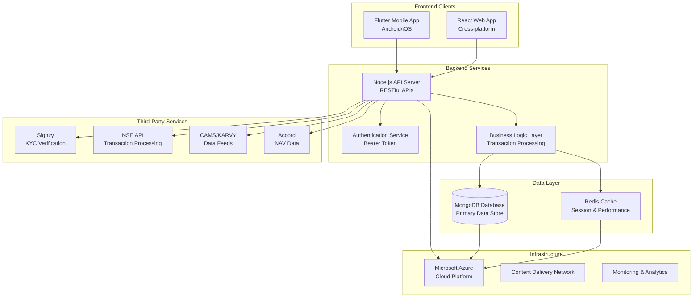
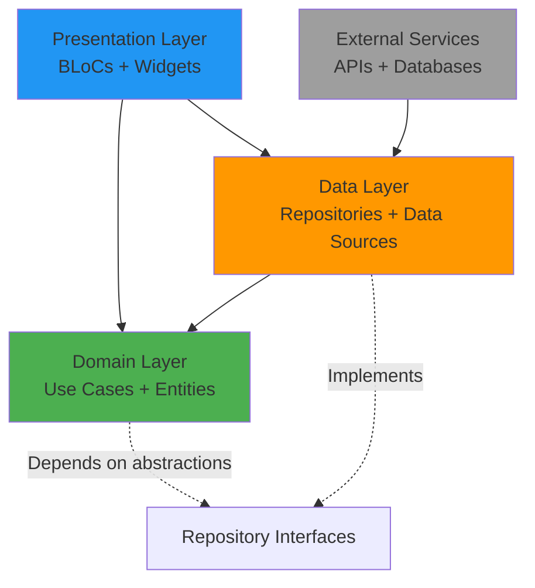
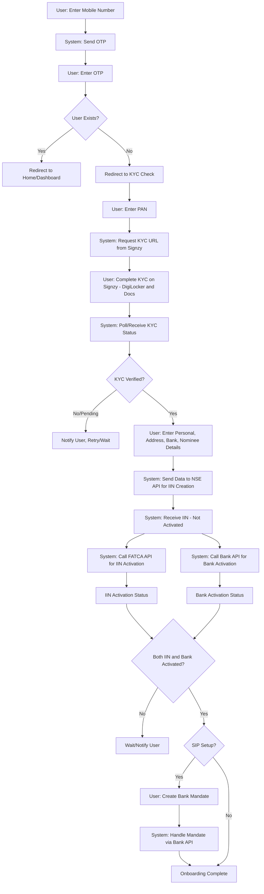
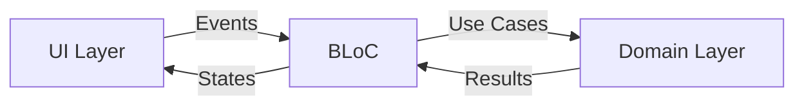

# Architecture Overview

> **Version**: 2.0
> **Last Updated**: January 2025

This document provides a comprehensive overview of the Prodigy Pro v2.0 architecture, covering design principles, system components, data flow, and implementation patterns.

## Table of Contents

1. [Architecture Principles](#architecture-principles)
2. [System Overview](#system-overview)
3. [Clean Architecture Implementation](#clean-architecture-implementation)
4. [Layer Separation](#layer-separation)
5. [Data Flow & Component Interactions](#data-flow--component-interactions)
6. [State Management](#state-management)
7. [Dependency Injection](#dependency-injection)
8. [Error Handling](#error-handling)
9. [Security Architecture](#security-architecture)
10. [Performance Considerations](#performance-considerations)

---

## Architecture Principles

Prodigy Pro v2.0 follows **Clean Architecture** principles with these core tenets:

### 1. Separation of Concerns
- Clear boundaries between presentation, business logic, and data layers
- Each layer has distinct responsibilities and dependencies
- Business logic is independent of frameworks and external agencies

### 2. Dependency Inversion
- High-level modules don't depend on low-level modules
- Both depend on abstractions (interfaces)
- Dependencies point inward toward business logic

### 3. Testability
- Each layer can be tested in isolation
- Dependencies are injected and can be mocked
- Business logic is framework-independent

### 4. Maintainability
- Modular structure enables easy feature additions
- Clear boundaries make code easier to understand and modify
- Single responsibility principle applied throughout

### 5. Scalability
- Architecture supports horizontal and vertical scaling
- Stateless design enables distributed processing
- Caching strategies for performance optimization

---

## System Overview

Prodigy Pro is a multi-platform mutual fund investment application architected for scalability, security, and seamless user experience.

### High-Level Architecture



### System Components

#### 1. Frontend Clients

**Mobile App (Flutter)**
- **Platform**: Android and iOS with unified codebase
- **Features**: Complete user experience for investment management
- **Architecture**: BLoC pattern for state management
- **Modules**:
  - Onboarding & Authentication
  - KYC & IIN Creation
  - Portfolio Management
  - Transaction Processing
  - Financial Calculators
  - Goal Planning
  - Support & Help

**Web App (React)**
- **Platform**: Cross-browser compatibility
- **Features**: Similar functionality to mobile app
- **Architecture**: Redux for state management
- **Target**: Desktop users and broader accessibility

#### 2. Backend Services

**API Server (Node.js)**
- **Technology**: Node.js with Express framework
- **Architecture**: RESTful API design
- **Responsibilities**:
  - Business logic processing
  - Data validation and transformation
  - External service integration
  - Authentication and authorization

**Database (MongoDB)**
- **Type**: NoSQL document database
- **Usage**: Primary data storage for all application data
- **Collections**:
  - Users and profiles
  - Transactions and orders
  - Portfolio holdings
  - KYC records
  - Audit logs

#### 3. Third-Party Integrations

**KYC Providers**
- **Signzy**: Primary KYC verification with DigiLocker integration
- **Aditya Birla AMC**: Alternative KYC provider
- **CAMS (KRA)**: Central KYC Records Agency

**Transaction Processing**
- **NSE API**: IIN creation and mutual fund transactions
- **Payment Gateways**: Secure payment processing

**Data Providers**
- **CAMS & KARVY**: Transaction reconciliation and reporting
- **Accord**: Real-time NAV and scheme information

#### 4. Infrastructure

**Cloud Platform (Microsoft Azure)**
- **Scalability**: Auto-scaling capabilities
- **Reliability**: High availability and disaster recovery
- **Security**: Enterprise-grade security features
- **Monitoring**: Comprehensive logging and analytics

---

## Clean Architecture Implementation

### Directory Structure

```
lib/
├── main.dart                    # Application entry point
├── app/                        # Application configuration
│   ├── app.dart
│   └── routes/
├── core/                       # Shared utilities and constants
│   ├── constants/
│   ├── utils/
│   ├── theme/
│   ├── network/
│   └── widgets/
├── domain/                     # Business Logic Layer
│   ├── entities/              # Business objects
│   ├── repositories/          # Repository interfaces
│   └── usecases/             # Business use cases
├── data/                      # Data Layer
│   ├── datasources/          # Remote and local data sources
│   ├── models/               # Data models
│   ├── repositories/         # Repository implementations
│   └── cache/                # Caching strategies
├── presentation/              # Presentation Layer
│   ├── blocs/                # BLoC state management
│   ├── pages/                # Screen widgets
│   ├── widgets/              # Reusable UI components
│   └── themes/               # Theme definitions
└── injection/                 # Dependency injection
    └── injection_container.dart
```

### Layer Dependencies



---

## Layer Separation

### 1. Presentation Layer

**Responsibilities:**
- User interface and user experience
- State management with BLoC pattern
- User input handling and validation
- Navigation and routing

**Key Components:**
```dart
// BLoC for state management
class PortfolioBloc extends Bloc<PortfolioEvent, PortfolioState> {
  final GetPortfolioUseCase _getPortfolioUseCase;

  PortfolioBloc({
    required GetPortfolioUseCase getPortfolioUseCase,
  }) : _getPortfolioUseCase = getPortfolioUseCase,
       super(PortfolioInitial());
}

// Screen widgets
class PortfolioScreen extends StatelessWidget {
  @override
  Widget build(BuildContext context) {
    return BlocProvider(
      create: (context) => sl<PortfolioBloc>(),
      child: PortfolioView(),
    );
  }
}
```

### 2. Domain Layer

**Responsibilities:**
- Business entities and rules
- Use case definitions
- Repository interfaces
- Framework-independent business logic

**Key Components:**
```dart
// Entity
class Portfolio {
  final double totalValue;
  final double totalInvestment;
  final double totalGain;
  final List<Holding> holdings;

  const Portfolio({
    required this.totalValue,
    required this.totalInvestment,
    required this.totalGain,
    required this.holdings,
  });
}

// Use Case
class GetPortfolioUseCase {
  final PortfolioRepository repository;

  GetPortfolioUseCase(this.repository);

  Future<Either<Failure, Portfolio>> call() async {
    return await repository.getPortfolio();
  }
}

// Repository Interface
abstract class PortfolioRepository {
  Future<Either<Failure, Portfolio>> getPortfolio();
  Future<Either<Failure, void>> refreshPortfolio();
}
```

### 3. Data Layer

**Responsibilities:**
- Repository implementations
- Data source abstractions (remote/local)
- Data models and transformations
- Caching and offline support

**Key Components:**
```dart
// Repository Implementation
class PortfolioRepositoryImpl implements PortfolioRepository {
  final PortfolioRemoteDataSource remoteDataSource;
  final PortfolioLocalDataSource localDataSource;
  final NetworkInfo networkInfo;

  PortfolioRepositoryImpl({
    required this.remoteDataSource,
    required this.localDataSource,
    required this.networkInfo,
  });

  @override
  Future<Either<Failure, Portfolio>> getPortfolio() async {
    if (await networkInfo.isConnected) {
      try {
        final portfolio = await remoteDataSource.getPortfolio();
        await localDataSource.cachePortfolio(portfolio);
        return Right(portfolio.toEntity());
      } catch (e) {
        return Left(ServerFailure());
      }
    } else {
      try {
        final portfolio = await localDataSource.getLastPortfolio();
        return Right(portfolio.toEntity());
      } catch (e) {
        return Left(CacheFailure());
      }
    }
  }
}
```

---

## Data Flow & Component Interactions

### User Onboarding Flow



### Component Interactions

#### 1. Frontend to Backend Communication
- **Protocol**: HTTPS RESTful APIs
- **Authentication**: Bearer token-based security
- **Data Format**: JSON for all request/response payloads
- **Error Handling**: Standardized error codes and messages

#### 2. Backend Processing
- **Request Validation**: Input sanitization and validation
- **Business Logic**: Core processing and decision making
- **Data Operations**: CRUD operations on MongoDB
- **External Integration**: Third-party service calls

#### 3. Third-Party Service Integration
- **KYC Flow**: Signzy integration for identity verification
- **Transaction Processing**: NSE API for mutual fund operations
- **Data Synchronization**: CAMS/KARVY for reconciliation
- **Real-time Data**: Accord for NAV updates

#### 4. Security and Data Flow
- **Encryption**: All data encrypted in transit and at rest
- **Access Control**: Role-based permissions and API rate limiting
- **Audit Logging**: Comprehensive activity tracking
- **Compliance**: Regulatory requirement adherence

---

## State Management

Prodigy Pro v2.0 uses the **BLoC (Business Logic Component)** pattern for state management:

### BLoC Architecture



### Implementation Example

```dart
// Events
abstract class PortfolioEvent extends Equatable {
  const PortfolioEvent();
}

class LoadPortfolio extends PortfolioEvent {
  @override
  List<Object> get props => [];
}

class RefreshPortfolio extends PortfolioEvent {
  @override
  List<Object> get props => [];
}

// States
abstract class PortfolioState extends Equatable {
  const PortfolioState();
}

class PortfolioInitial extends PortfolioState {
  @override
  List<Object> get props => [];
}

class PortfolioLoading extends PortfolioState {
  @override
  List<Object> get props => [];
}

class PortfolioLoaded extends PortfolioState {
  final Portfolio portfolio;

  const PortfolioLoaded({required this.portfolio});

  @override
  List<Object> get props => [portfolio];
}

class PortfolioError extends PortfolioState {
  final String message;

  const PortfolioError({required this.message});

  @override
  List<Object> get props => [message];
}

// BLoC Implementation
class PortfolioBloc extends Bloc<PortfolioEvent, PortfolioState> {
  final GetPortfolioUseCase _getPortfolioUseCase;
  final RefreshPortfolioUseCase _refreshPortfolioUseCase;

  PortfolioBloc({
    required GetPortfolioUseCase getPortfolioUseCase,
    required RefreshPortfolioUseCase refreshPortfolioUseCase,
  }) : _getPortfolioUseCase = getPortfolioUseCase,
       _refreshPortfolioUseCase = refreshPortfolioUseCase,
       super(PortfolioInitial()) {
    on<LoadPortfolio>(_onLoadPortfolio);
    on<RefreshPortfolio>(_onRefreshPortfolio);
  }

  Future<void> _onLoadPortfolio(
    LoadPortfolio event,
    Emitter<PortfolioState> emit,
  ) async {
    emit(PortfolioLoading());

    final result = await _getPortfolioUseCase();

    result.fold(
      (failure) => emit(PortfolioError(message: failure.message)),
      (portfolio) => emit(PortfolioLoaded(portfolio: portfolio)),
    );
  }
}
```

---

## Dependency Injection

We use **get_it** for dependency injection with a service locator pattern:

### Setup

```dart
// injection_container.dart
final sl = GetIt.instance;

Future<void> init() async {
  // BLoCs
  sl.registerFactory(
    () => PortfolioBloc(
      getPortfolioUseCase: sl(),
      refreshPortfolioUseCase: sl(),
    ),
  );

  // Use Cases
  sl.registerLazySingleton(() => GetPortfolioUseCase(sl()));
  sl.registerLazySingleton(() => RefreshPortfolioUseCase(sl()));

  // Repositories
  sl.registerLazySingleton<PortfolioRepository>(
    () => PortfolioRepositoryImpl(
      remoteDataSource: sl(),
      localDataSource: sl(),
      networkInfo: sl(),
    ),
  );

  // Data Sources
  sl.registerLazySingleton<PortfolioRemoteDataSource>(
    () => PortfolioRemoteDataSourceImpl(client: sl()),
  );

  sl.registerLazySingleton<PortfolioLocalDataSource>(
    () => PortfolioLocalDataSourceImpl(sharedPreferences: sl()),
  );

  // External
  sl.registerLazySingleton(() => http.Client());
  sl.registerLazySingleton<NetworkInfo>(() => NetworkInfoImpl(sl()));

  // Core
  final sharedPreferences = await SharedPreferences.getInstance();
  sl.registerLazySingleton(() => sharedPreferences);
}
```

---

## Error Handling

### Error Hierarchy

```dart
abstract class Failure extends Equatable {
  final String message;
  final String? code;

  const Failure({required this.message, this.code});

  @override
  List<Object?> get props => [message, code];
}

class ServerFailure extends Failure {
  const ServerFailure({String? message, String? code})
      : super(message: message ?? 'Server error occurred', code: code);
}

class CacheFailure extends Failure {
  const CacheFailure({String? message})
      : super(message: message ?? 'Cache error occurred');
}

class NetworkFailure extends Failure {
  const NetworkFailure({String? message})
      : super(message: message ?? 'Network error occurred');
}

class ValidationFailure extends Failure {
  const ValidationFailure({required String message, String? code})
      : super(message: message, code: code);
}
```

### Error Handling in BLoCs

```dart
Future<void> _onLoadPortfolio(
  LoadPortfolio event,
  Emitter<PortfolioState> emit,
) async {
  emit(PortfolioLoading());

  final result = await _getPortfolioUseCase();

  result.fold(
    (failure) {
      String errorMessage;

      if (failure is NetworkFailure) {
        errorMessage = 'Please check your internet connection';
      } else if (failure is CacheFailure) {
        errorMessage = 'Unable to load cached data';
      } else {
        errorMessage = failure.message;
      }

      emit(PortfolioError(message: errorMessage));
    },
    (portfolio) => emit(PortfolioLoaded(portfolio: portfolio)),
  );
}
```

---

## Security Architecture

### Authentication & Authorization

```dart
class AuthenticationService {
  Future<Either<Failure, AuthToken>> login({
    required String mobile,
    required String otp,
  }) async {
    // Implementation
  }

  Future<bool> isTokenValid(String token) async {
    // Token validation logic
  }

  Future<void> logout() async {
    // Clear tokens and user data
  }
}

class AuthInterceptor extends Interceptor {
  @override
  void onRequest(RequestOptions options, RequestInterceptorHandler handler) {
    final token = getStoredToken();
    if (token != null) {
      options.headers['Authorization'] = 'Bearer $token';
    }
    handler.next(options);
  }
}
```

### Data Protection

```dart
class EncryptionService {
  static const _key = 'your-encryption-key';

  static String encrypt(String data) {
    // Encryption implementation
    return encryptedData;
  }

  static String decrypt(String encryptedData) {
    // Decryption implementation
    return decryptedData;
  }
}

class SecureStorage {
  static Future<void> storeSecurely(String key, String value) async {
    final encrypted = EncryptionService.encrypt(value);
    await secureStorageInstance.write(key: key, value: encrypted);
  }

  static Future<String?> retrieveSecurely(String key) async {
    final encrypted = await secureStorageInstance.read(key: key);
    return encrypted != null ? EncryptionService.decrypt(encrypted) : null;
  }
}
```

---

## Performance Considerations

### Caching Strategy

```dart
class CacheManager {
  static const Duration _defaultTtl = Duration(minutes: 15);

  static Future<T?> get<T>(
    String key, {
    required T Function(Map<String, dynamic>) fromJson,
    Duration? ttl,
  }) async {
    final cached = await _storage.get(key);
    if (cached != null && !_isExpired(cached, ttl ?? _defaultTtl)) {
      return fromJson(cached['data']);
    }
    return null;
  }

  static Future<void> set<T>(
    String key,
    T data, {
    Duration? ttl,
  }) async {
    await _storage.set(key, {
      'data': data,
      'timestamp': DateTime.now().millisecondsSinceEpoch,
      'ttl': (ttl ?? _defaultTtl).inMilliseconds,
    });
  }
}
```

### Image Optimization

```dart
class OptimizedNetworkImage extends StatelessWidget {
  final String imageUrl;
  final double? width;
  final double? height;

  const OptimizedNetworkImage({
    Key? key,
    required this.imageUrl,
    this.width,
    this.height,
  }) : super(key: key);

  @override
  Widget build(BuildContext context) {
    return CachedNetworkImage(
      imageUrl: imageUrl,
      width: width,
      height: height,
      placeholder: (context, url) => const CircularProgressIndicator(),
      errorWidget: (context, url, error) => const Icon(Icons.error),
      memCacheWidth: width?.toInt(),
      memCacheHeight: height?.toInt(),
    );
  }
}
```

### Memory Management

```dart
class BlocManager {
  static final Map<Type, Bloc> _blocs = {};

  static T getBloc<T extends Bloc>() {
    return _blocs[T] as T;
  }

  static void disposeBloc<T extends Bloc>() {
    final bloc = _blocs[T];
    if (bloc != null) {
      bloc.close();
      _blocs.remove(T);
    }
  }

  static void disposeAllBlocs() {
    for (final bloc in _blocs.values) {
      bloc.close();
    }
    _blocs.clear();
  }
}
```

---

## Migration Strategy (v1.0 to v2.0)

### Key Changes
1. **State Management**: GetX → BLoC pattern
2. **Architecture**: MVC → Clean Architecture
3. **Data Layer**: Direct API calls → Repository pattern
4. **Navigation**: GetX routing → Named routes with GoRouter
5. **Dependency Injection**: GetX bindings → get_it service locator

### Migration Phases
1. **Foundation Setup** (2 weeks)
2. **Data Layer Migration** (3 weeks)
3. **Authentication Migration** (2 weeks)
4. **Calculator Migration** (2 weeks)
5. **Portfolio Migration** (3 weeks)
6. **Feature Completion** (3 weeks)
7. **Testing & Launch** (2 weeks)

For detailed migration information, see [Migration Guide](../migration/v1-to-v2-migration.md).

---

*This architecture documentation is continuously updated as the system evolves. For specific implementation details, refer to the individual component documentation.*
