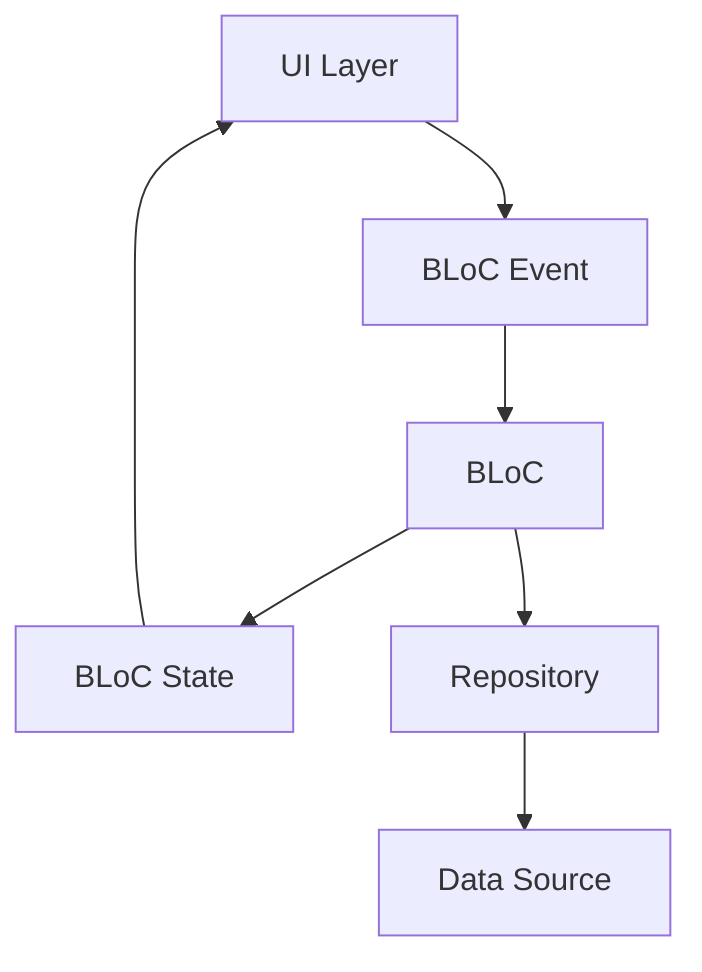

# BLoC Pattern Implementation Guide

## Table of Contents
1. [Overview](#overview)
2. [BLoC Architecture](#bloc-architecture)
3. [Implementation Patterns](#implementation-patterns)
4. [Event Design](#event-design)
5. [State Management](#state-management)
6. [Real-World Examples](#real-world-examples)
7. [Best Practices](#best-practices)
8. [Testing BLoCs](#testing-blocs)
9. [GetX to BLoC Migration](#getx-to-bloc-migration)
10. [Common Patterns](#common-patterns)

---

## Overview

The BLoC (Business Logic Component) pattern is the core state management solution for Prodigy Pro v2.0. It provides a clear separation between business logic and UI, making the application more testable, maintainable, and scalable.

### Key Benefits
- **Testability**: Business logic is completely separated from UI
- **Reusability**: BLoCs can be used across multiple widgets
- **Predictability**: State changes are immutable and traceable
- **Debugging**: Easy to trace state changes and debug issues
- **Performance**: Efficient rebuilds only when state actually changes

### BLoC vs GetX Comparison

| Aspect | GetX (v1.0) | BLoC (v2.0) |
|--------|-------------|-------------|
| State Updates | Reactive (`.obs`) | Immutable state objects |
| Business Logic | Mixed with UI concerns | Pure business logic |
| Testing | Difficult to unit test | Easy to unit test |
| Debugging | Limited traceability | Full state transition logs |
| Performance | Good | Better (fewer rebuilds) |

---

## BLoC Architecture

### Core Components



### Component Responsibilities

1. **Events**: Represent user actions or system events
2. **States**: Represent the current state of the application
3. **BLoC**: Processes events and emits states
4. **Repository**: Handles data operations (injected into BLoC)

---

## Implementation Patterns

### 1. File Structure

```
lib/presentation/feature_name/
├── bloc/
│   ├── feature_bloc.dart
│   ├── feature_event.dart
│   └── feature_state.dart
├── view/
│   └── feature_screen.dart
├── widgets/
│   └── feature_widgets.dart
└── models/
    └── feature_models.dart
```

### 2. Event Definition

```dart
// feature_event.dart
abstract class FeatureEvent extends Equatable {
  const FeatureEvent();

  @override
  List<Object?> get props => [];
}

class LoadFeatureData extends FeatureEvent {
  final String? userId;

  const LoadFeatureData({this.userId});

  @override
  List<Object?> get props => [userId];
}

class UpdateFeatureValue extends FeatureEvent {
  final String value;

  const UpdateFeatureValue({required this.value});

  @override
  List<Object?> get props => [value];
}
```

### 3. State Definition

```dart
// feature_state.dart
abstract class FeatureState extends Equatable {
  const FeatureState();

  @override
  List<Object?> get props => [];
}

class FeatureInitial extends FeatureState {}

class FeatureLoading extends FeatureState {}

class FeatureLoaded extends FeatureState {
  final FeatureData data;

  const FeatureLoaded({required this.data});

  @override
  List<Object?> get props => [data];
}

class FeatureError extends FeatureState {
  final String message;

  const FeatureError({required this.message});

  @override
  List<Object?> get props => [message];
}
```

### 4. BLoC Implementation

```dart
// feature_bloc.dart
class FeatureBloc extends Bloc<FeatureEvent, FeatureState> {
  final FeatureRepository _repository;

  FeatureBloc(this._repository) : super(FeatureInitial()) {
    on<LoadFeatureData>(_onLoadFeatureData);
    on<UpdateFeatureValue>(_onUpdateFeatureValue);
  }

  Future<void> _onLoadFeatureData(
    LoadFeatureData event,
    Emitter<FeatureState> emit,
  ) async {
    try {
      emit(FeatureLoading());

      final data = await _repository.getFeatureData(event.userId);

      emit(FeatureLoaded(data: data));
    } catch (error) {
      emit(FeatureError(message: error.toString()));
    }
  }

  void _onUpdateFeatureValue(
    UpdateFeatureValue event,
    Emitter<FeatureState> emit,
  ) {
    // Validation logic
    if (event.value.isEmpty) {
      emit(FeatureError(message: 'Value cannot be empty'));
      return;
    }

    // Business logic
    emit(FeatureLoaded(data: updatedData));
  }
}
```

---

## Event Design

### Event Naming Conventions

```dart
// Good: Descriptive action names
class SubmitRegistrationForm extends AuthEvent {}
class ValidatePhoneNumber extends AuthEvent {}
class UpdateMonthlySaving extends CalculatorEvent {}

// Bad: Property-based naming
class AuthData extends AuthEvent {}
class CalculatorData extends CalculatorEvent {}
```

### Event Categories

#### 1. **User Interaction Events**
```dart
class ButtonPressed extends FeatureEvent {}
class FormSubmitted extends FeatureEvent {}
class InputChanged extends FeatureEvent {
  final String value;
  const InputChanged({required this.value});
}
```

#### 2. **Data Loading Events**
```dart
class LoadInitialData extends FeatureEvent {}
class RefreshData extends FeatureEvent {}
class LoadMoreData extends FeatureEvent {}
```

#### 3. **Validation Events**
```dart
class ValidateInput extends FeatureEvent {
  final String input;
  const ValidateInput({required this.input});
}
```

---

## State Management

### State Design Principles

#### 1. **Immutability**
```dart
// Good: Immutable state
class CalculatorState extends Equatable {
  final double monthlyAmount;
  final int period;
  final bool isLoading;

  const CalculatorState({
    required this.monthlyAmount,
    required this.period,
    required this.isLoading,
  });

  CalculatorState copyWith({
    double? monthlyAmount,
    int? period,
    bool? isLoading,
  }) {
    return CalculatorState(
      monthlyAmount: monthlyAmount ?? this.monthlyAmount,
      period: period ?? this.period,
      isLoading: isLoading ?? this.isLoading,
    );
  }

  @override
  List<Object?> get props => [monthlyAmount, period, isLoading];
}
```

#### 2. **State Hierarchy**
```dart
abstract class AuthState extends Equatable {
  const AuthState();
  @override
  List<Object?> get props => [];
}

// Initial state
class AuthInitial extends AuthState {}

// Loading states
class AuthLoading extends AuthState {}

// Success states
class AuthSuccess extends AuthState {
  final User user;
  const AuthSuccess({required this.user});
  @override
  List<Object?> get props => [user];
}

// Error states
class AuthError extends AuthState {
  final String message;
  const AuthError({required this.message});
  @override
  List<Object?> get props => [message];
}
```

---

## Real-World Examples

### Example 1: SIP Calculator (Existing Implementation)

Based on the current codebase implementation:

```dart
// Current SIP Calculator BLoC (lib/presentation/financial_calculators/sip_calculator/bloc/)
class SipCalculatorBloc extends Bloc<SipCalculatorEvent, SipCalculatorState> {
  SipCalculatorBloc() : super(SipCalculatorInitial()) {
    on<UpdateInvestmentPeriod>(_onUpdateInvestmentPeriod);
    on<UpdateMonthlySavings>(_onUpdateMonthlySavings);
    on<UpdateRateOfReturn>(_onUpdateRateOfReturn);
    on<CalculateSipEvent>(_onCalculateSipEvent);
  }

  void _onUpdateMonthlySavings(
    UpdateMonthlySavings event,
    Emitter<SipCalculatorState> emit,
  ) {
    // Validation logic with business rules
    int minSav = 500;
    int maxSav = 1000000;

    if (double.parse(event.monthlySaving) < minSav) {
      emit(SipMonthlySavingErrorState(
        "Minimum amount should be ${minSav.formatCurrencyShortForm()}"
      ));
      return;
    }

    if (double.parse(event.monthlySaving) > maxSav) {
      emit(SipMonthlySavingErrorState(
        "Maximum amount should be ${maxSav.formatCurrencyShortForm()}"
      ));
      return;
    }

    emit(SipCalculatorMonthSavUpdated(monthlySaving: event.monthlySaving));
  }

  void _onCalculateSipEvent(
    CalculateSipEvent event,
    Emitter<SipCalculatorState> emit,
  ) {
    // Complex calculation logic
    double monthlyRate = (event.rateOfReturn / 12) / 100;
    double months = event.investmentPeriod * 12;
    double futureValue = event.monthlySaving *
        (pow(1 + monthlyRate, months) - 1) / monthlyRate;

    // Generate graph data
    final graphData = _generateGraphData(
      event.investmentPeriod,
      event.monthlySaving,
      event.rateOfReturn,
      futureValue,
    );

    emit(SipCalculatorSuccessState(
      SipCalculatorResultModel(
        rateOfReturn: event.rateOfReturn,
        mainResult: futureValue,
        totalSaving: event.monthlySaving * months,
        graphData: graphData,
      ),
    ));
  }
}
```

### Example 2: User Authentication (Migration Target)

```dart
// Target implementation for User Authentication
class AuthBloc extends Bloc<AuthEvent, AuthState> {
  final AuthRepository _authRepository;

  AuthBloc(this._authRepository) : super(AuthInitial()) {
    on<LoginWithEmailRequested>(_onLoginWithEmailRequested);
    on<VerifyOTPRequested>(_onVerifyOTPRequested);
    on<SetUserPinRequested>(_onSetUserPinRequested);
  }

  Future<void> _onLoginWithEmailRequested(
    LoginWithEmailRequested event,
    Emitter<AuthState> emit,
  ) async {
    try {
      emit(AuthLoading());

      final response = await _authRepository.loginWithEmail(
        email: event.email,
        password: event.password,
      );

      if (response.success) {
        await _saveUserSession(response.data);
        emit(AuthSuccess(user: response.data.user));
      } else {
        emit(AuthError(message: response.message));
      }
    } catch (error) {
      emit(AuthError(message: error.toString()));
    }
  }
}
```

---

## Best Practices

### 1. **Event Naming**
```dart
// Good: Action-based naming
class SubmitRegistrationForm extends AuthEvent {}
class ValidatePhoneNumber extends AuthEvent {}
class UpdateMonthlySaving extends CalculatorEvent {}

// Bad: Property-based naming
class AuthData extends AuthEvent {}
class CalculatorData extends CalculatorEvent {}
```

### 2. **State Composition**
```dart
// Good: Specific state classes
class AuthLoading extends AuthState {}
class AuthSuccess extends AuthState {
  final User user;
  const AuthSuccess({required this.user});
}

// Bad: Generic state with flags
class AuthState {
  final bool isLoading;
  final User? user;
  final String? error;
  // This makes it hard to handle different combinations
}
```

### 3. **Error Handling**
```dart
Future<void> _onLoadData(
  LoadData event,
  Emitter<DataState> emit,
) async {
  try {
    emit(DataLoading());

    final data = await _repository.getData();

    emit(DataLoaded(data: data));
  } on NetworkException catch (e) {
    emit(DataError(message: 'Network error: ${e.message}'));
  } on ValidationException catch (e) {
    emit(DataError(message: 'Validation error: ${e.message}'));
  } catch (e) {
    emit(DataError(message: 'Unexpected error occurred'));
  }
}
```

### 4. **Business Logic Separation**
```dart
// Good: Pure business logic in BLoC
class CalculatorBloc extends Bloc<CalculatorEvent, CalculatorState> {
  Future<void> _onCalculate(
    CalculateEvent event,
    Emitter<CalculatorState> emit,
  ) async {
    // Validation
    if (!_isValidInput(event.input)) {
      emit(CalculatorError(message: 'Invalid input'));
      return;
    }

    // Business logic
    final result = _performCalculation(event.input);

    emit(CalculatorSuccess(result: result));
  }

  bool _isValidInput(CalculatorInput input) {
    // Pure validation logic
  }

  CalculatorResult _performCalculation(CalculatorInput input) {
    // Pure calculation logic
  }
}
```

---

## Testing BLoCs

### 1. **Unit Testing Setup**
```dart
// test/presentation/calculator/bloc/calculator_bloc_test.dart
import 'package:bloc_test/bloc_test.dart';
import 'package:flutter_test/flutter_test.dart';
import 'package:mockito/mockito.dart';

class MockCalculatorRepository extends Mock implements CalculatorRepository {}

void main() {
  group('CalculatorBloc', () {
    late CalculatorBloc calculatorBloc;
    late MockCalculatorRepository mockRepository;

    setUp(() {
      mockRepository = MockCalculatorRepository();
      calculatorBloc = CalculatorBloc(mockRepository);
    });

    tearDown(() {
      calculatorBloc.close();
    });

    test('initial state is CalculatorInitial', () {
      expect(calculatorBloc.state, equals(CalculatorInitial()));
    });

    blocTest<CalculatorBloc, CalculatorState>(
      'emits [CalculatorLoading, CalculatorSuccess] when calculation succeeds',
      build: () {
        when(mockRepository.calculateSIP(any))
            .thenAnswer((_) async => mockCalculationResult);
        return calculatorBloc;
      },
      act: (bloc) => bloc.add(CalculateEvent(input: validInput)),
      expect: () => [
        CalculatorLoading(),
        CalculatorSuccess(result: mockCalculationResult),
      ],
    );
  });
}
```

### 2. **Testing State Transitions**
```dart
blocTest<AuthBloc, AuthState>(
  'emits correct states during login flow',
  build: () => authBloc,
  act: (bloc) => bloc
    ..add(LoginRequested(email: 'test@example.com', password: 'password'))
    ..add(VerifyOTPRequested(otp: '123456')),
  expect: () => [
    AuthLoading(),
    OTPRequired(email: 'test@example.com'),
    AuthLoading(),
    AuthSuccess(user: mockUser),
  ],
);
```

---

## GetX to BLoC Migration

### Migration Strategy

#### 1. **Controller to BLoC Conversion**

**Before (GetX Controller):**
```dart
class UserController extends GetxController {
  final RxBool isLoading = false.obs;
  final Rx<User?> user = Rx<User?>(null);
  final RxString error = ''.obs;

  Future<void> loginUser(String email, String password) async {
    try {
      isLoading(true);
      final result = await NetworkCall().makeRequest(/*...*/);
      user.value = User.fromJson(result.data);
    } catch (e) {
      error.value = e.toString();
    } finally {
      isLoading(false);
    }
  }
}
```

**After (BLoC):**
```dart
// Events
abstract class UserEvent extends Equatable {
  @override
  List<Object?> get props => [];
}

class LoginRequested extends UserEvent {
  final String email;
  final String password;

  LoginRequested({required this.email, required this.password});

  @override
  List<Object?> get props => [email, password];
}

// States
abstract class UserState extends Equatable {
  @override
  List<Object?> get props => [];
}

class UserInitial extends UserState {}
class UserLoading extends UserState {}
class UserLoaded extends UserState {
  final User user;
  UserLoaded({required this.user});
  @override
  List<Object?> get props => [user];
}
class UserError extends UserState {
  final String message;
  UserError({required this.message});
  @override
  List<Object?> get props => [message];
}

// BLoC
class UserBloc extends Bloc<UserEvent, UserState> {
  final UserRepository _repository;

  UserBloc(this._repository) : super(UserInitial()) {
    on<LoginRequested>(_onLoginRequested);
  }

  Future<void> _onLoginRequested(
    LoginRequested event,
    Emitter<UserState> emit,
  ) async {
    try {
      emit(UserLoading());
      final user = await _repository.login(event.email, event.password);
      emit(UserLoaded(user: user));
    } catch (error) {
      emit(UserError(message: error.toString()));
    }
  }
}
```

#### 2. **UI Migration**

**Before (GetX):**
```dart
class UserScreen extends StatelessWidget {
  final UserController controller = Get.find();

  @override
  Widget build(BuildContext context) {
    return Scaffold(
      body: Obx(() {
        if (controller.isLoading.value) {
          return CircularProgressIndicator();
        }
        if (controller.error.value.isNotEmpty) {
          return Text(controller.error.value);
        }
        if (controller.user.value != null) {
          return Text('Welcome ${controller.user.value!.name}');
        }
        return LoginForm();
      }),
    );
  }
}
```

**After (BLoC):**
```dart
class UserScreen extends StatelessWidget {
  @override
  Widget build(BuildContext context) {
    return Scaffold(
      body: BlocBuilder<UserBloc, UserState>(
        builder: (context, state) {
          if (state is UserLoading) {
            return CircularProgressIndicator();
          }
          if (state is UserError) {
            return Text(state.message);
          }
          if (state is UserLoaded) {
            return Text('Welcome ${state.user.name}');
          }
          return LoginForm();
        },
      ),
    );
  }
}
```

---

## Common Patterns

### 1. **Form Handling**
```dart
class FormBloc extends Bloc<FormEvent, FormState> {
  FormBloc() : super(FormState.initial()) {
    on<FieldChanged>(_onFieldChanged);
    on<FormSubmitted>(_onFormSubmitted);
  }

  void _onFieldChanged(
    FieldChanged event,
    Emitter<FormState> emit,
  ) {
    emit(state.copyWith(
      fields: {...state.fields, event.field: event.value},
      errors: {...state.errors}..remove(event.field),
    ));
  }
}
```

### 2. **List Management**
```dart
class ListBloc extends Bloc<ListEvent, ListState> {
  void _onLoadList(LoadList event, Emitter<ListState> emit) async {
    emit(state.copyWith(isLoading: true));

    final items = await _repository.getItems();

    emit(state.copyWith(
      items: items,
      isLoading: false,
    ));
  }

  void _onAddItem(AddItem event, Emitter<ListState> emit) {
    emit(state.copyWith(
      items: [...state.items, event.item],
    ));
  }
}
```

### 3. **Pagination**
```dart
class PaginatedListBloc extends Bloc<PaginatedListEvent, PaginatedListState> {
  void _onLoadMore(LoadMore event, Emitter<PaginatedListState> emit) async {
    if (state.hasReachedMax) return;

    try {
      final items = await _repository.getItems(page: state.currentPage + 1);

      emit(state.copyWith(
        items: [...state.items, ...items],
        currentPage: state.currentPage + 1,
        hasReachedMax: items.isEmpty,
      ));
    } catch (error) {
      emit(state.copyWith(error: error.toString()));
    }
  }
}
```

---

## Advanced BLoC Patterns

### 1. **BLoC Communication**
```dart
class AppBloc extends Bloc<AppEvent, AppState> {
  final AuthBloc _authBloc;
  late StreamSubscription _authSubscription;

  AppBloc(this._authBloc) : super(AppInitial()) {
    _authSubscription = _authBloc.stream.listen((authState) {
      if (authState is AuthSuccess) {
        add(UserLoggedIn(user: authState.user));
      } else if (authState is AuthInitial) {
        add(UserLoggedOut());
      }
    });
  }

  @override
  Future<void> close() {
    _authSubscription.cancel();
    return super.close();
  }
}
```

### 2. **Debouncing Events**
```dart
class SearchBloc extends Bloc<SearchEvent, SearchState> {
  SearchBloc() : super(SearchInitial()) {
    on<SearchQueryChanged>(
      _onSearchQueryChanged,
      transformer: debounce(Duration(milliseconds: 500)),
    );
  }
}

EventTransformer<T> debounce<T>(Duration duration) {
  return (events, mapper) => events.debounceTime(duration).flatMap(mapper);
}
```

---

*This guide provides a comprehensive foundation for implementing BLoC pattern in Prodigy Pro v2.0. For additional patterns and advanced use cases, refer to the [Flutter BLoC documentation](https://bloclibrary.dev/).*
