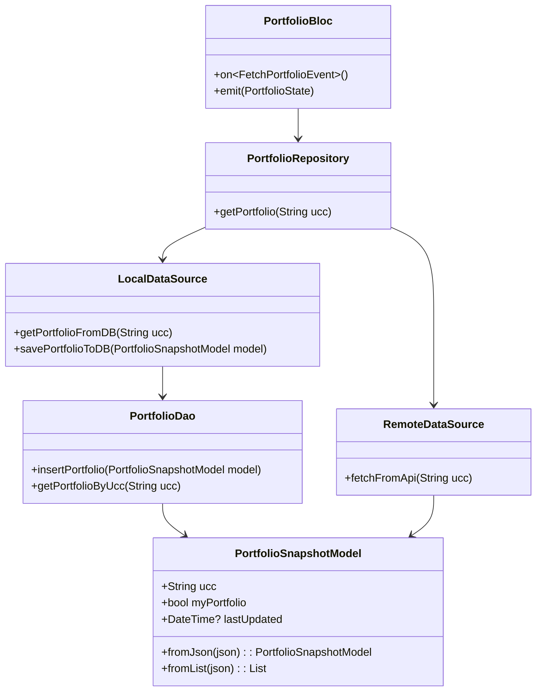
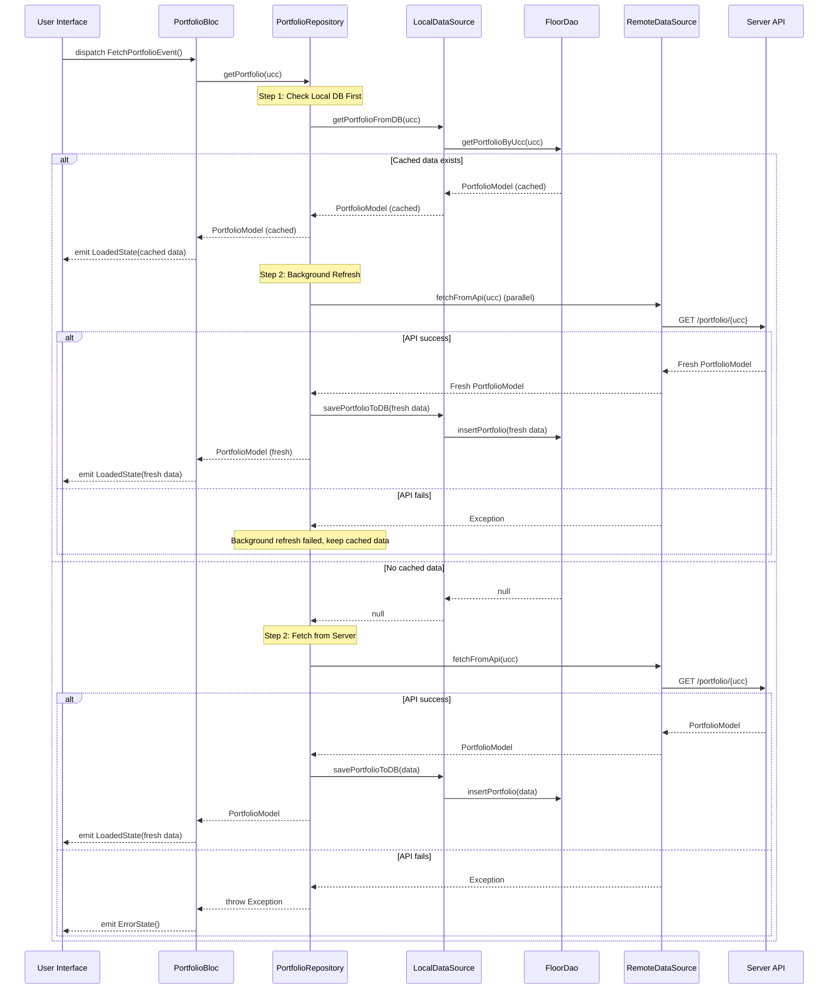

# 📘 Offline-First Data Fetching with Floor and BLoC

This document explains the **Offline-First architecture** implemented for fetching the **Portfolio** data in our Flutter app.
It is designed to:

✅ Always **try remote API first** to get fresh data
✅ **Cache successful responses** locally in SQLite (using Floor)
✅ **Fallback to cached data** when offline or API fails
✅ Provide a seamless experience to the user even without internet

---

## 1. Overview

**Problem:**
Users need to see their investment portfolio when they open the dashboard. Data should be fresh if online, but still available if offline.

**Solution:**
Use a **repository pattern** with remote and local data sources:

1. **Check local DB first** for immediate response.
2. If cached data exists:

   - Return cached data immediately to BLoC.
   - Start background API call in parallel.
   - Update local DB with fresh data when available.
   - Optionally notify UI of data updates.

3. If no cached data:

   - Fetch from API (RemoteDataSource).
   - Save successful responses to local DB.
   - Return fresh data to BLoC.

4. On API failure:

   - If no cached data available, emit error state.
   - If cached data exists, continue using cached data.

---

## 🧩 2. Class Responsibilities

Below is a description of each component and what it does.

---

### 🎛️ **Entity: `portfolio_snapshot`**

**Responsibilities:**

- Receives events (`FetchPortfolioEvent`).
- Emits states (`LoadingState`, `LoadedState`, `ErrorState`).
- Calls `PortfolioRepository.getPortfolio()`.

**Example:**

```dart
@Entity(
  tableName: 'portfolio_snapshot',
  primaryKeys: ['ucc', 'myPortfolio'],
)
class PortfolioSnapshotModel {
  final String ucc;                  // primary key (part 1)
  final bool myPortfolio;            // primary key (part 2)
  final String? totalPurchase;
  final String? totalMarketValue;
  final String? finalDays;
  final String? finalCAGR;
  final String? totalDaysChange;
  final String? gainLoss;
  final DateTime? lastUpdated;

  // Constructor
  const PortfolioSnapshotModel({ ... });

  // Create an instance from JSON map
  factory PortfolioSnapshotModel.fromJson(Map<String, dynamic> json) { ... }

  // Create a list of instances from JSON array
  static List<PortfolioSnapshotModel> fromList(List<dynamic> json) { ... }
}
```

#### 🔑 Entity Properties and Purpose

| Field Name         | Type      | Description                                                         |
| ------------------ | --------- | ------------------------------------------------------------------- |
| `ucc`              | String    | **Primary Key (part 1):** Unique Client Code identifying the user   |
| `myPortfolio`      | bool      | **Primary Key (part 2):** Whether this is user's personal portfolio |
| `totalPurchase`    | String?   | Total amount invested                                               |
| `totalMarketValue` | String?   | Current market value of portfolio                                   |
| `finalDays`        | String?   | Holding duration in days                                            |
| `finalCAGR`        | String?   | CAGR (Compounded Annual Growth Rate)                                |
| `totalDaysChange`  | String?   | Change in value over the holding period                             |
| `gainLoss`         | String?   | Overall gain or loss                                                |
| `lastUpdated`      | DateTime? | When this data was last updated locally                             |

#### 🧠 Why Composite Primary Key?

This is important:

```dart
primaryKeys: ['ucc', 'myPortfolio']
```

- This means the combination of `ucc` and `myPortfolio` **must be unique**.
- For example, the same UCC can have:
  - one record for `myPortfolio = true`
  - another record for `myPortfolio = false`
- This helps you track separate views (e.g., personal vs family portfolio).

---

### 🎛️ **BLoC: `PortfolioBloc`**

**Responsibilities:**

- Receives events (`FetchPortfolioEvent`).
- Emits states (`LoadingState`, `LoadedState`, `ErrorState`).
- Calls `PortfolioRepository.getPortfolio()`.

**Example:**

```dart
on<FetchPortfolioEvent>((event, emit) async {
  emit(LoadingState());
  try {
    final portfolio = await repository.getPortfolio(event.ucc);
    emit(LoadedState(portfolio));
  } catch (e) {
    emit(ErrorState('Failed to load portfolio'));
  }
});
```

---

### 🗄️ **Repository: `PortfolioRepository`**

**Responsibilities:**

- Single entry point for fetching portfolio data.
- Orchestrates:

  - RemoteDataSource (API call)
  - LocalDataSource (DB cache)

- Decides when to fallback to local cache.

**Key Method:**

```dart
Future<PortfolioModel> getPortfolio(String ucc) async {
  // Step 1: Check local DB first for immediate response
  final localData = await localDataSource.getPortfolioFromDB(ucc);
  
  if (localData != null) {
    // Return cached data immediately
    final cachedPortfolio = localData;
    
    // Step 2: Background refresh in parallel
    _refreshPortfolioInBackground(ucc);
    
    return cachedPortfolio;
  }
  
  // No cached data, fetch from server
  try {
    final remoteData = await remoteDataSource.fetchFromApi(ucc);
    await localDataSource.savePortfolioToDB(remoteData);
    return remoteData;
  } catch (e) {
    throw Exception('No data available');
  }
}

// Background refresh method
void _refreshPortfolioInBackground(String ucc) async {
  try {
    final freshData = await remoteDataSource.fetchFromApi(ucc);
    await localDataSource.savePortfolioToDB(freshData);
    
    // Optionally emit updated state to UI
    // This could be done through a stream or callback
  } catch (e) {
    // Background refresh failed, keep existing cached data
    print('Background refresh failed: $e');
  }
}
```

---

### 🌐 **RemoteDataSource**

**Responsibilities:**

- Makes HTTP requests to API.
- Parses the JSON response into `PortfolioModel`.

**Example:**

```dart
Future<PortfolioModel> fetchFromApi(String ucc) async {
  final response = await http.get(Uri.parse('$baseUrl/portfolio/$ucc'));
  if (response.statusCode == 200) {
    return PortfolioModel.fromJson(json.decode(response.body));
  } else {
    throw Exception('API error');
  }
}
```

---

### 🗃️ **LocalDataSource**

**Responsibilities:**

- Uses Floor DAOs to read/write data locally.
- Persists API data for offline access.

**Methods:**

```dart
Future<void> savePortfolioToDB(PortfolioModel model) async {
  await dao.insertPortfolio(model);
}

Future<PortfolioModel?> getPortfolioFromDB(String ucc) async {
  return await dao.getPortfolioByUcc(ucc);
}
```

---

### 🧱 **Floor DAO: `PortfolioDao`**

**Responsibilities:**

- Defines SQLite queries and inserts.

**Example:**

```dart
@dao
abstract class PortfolioDao {
  @Insert(onConflict: OnConflictStrategy.replace)
  Future<void> insertPortfolio(PortfolioModel model);

  @Query('SELECT * FROM portfolio WHERE ucc = :ucc LIMIT 1')
  Future<PortfolioModel?> getPortfolioByUcc(String ucc);
}
```

---

## 🔄 3. Runtime Data Flow

Here's how data flows step by step:

1. User opens dashboard.
2. `PortfolioBloc` receives `FetchPortfolioEvent`.
3. Bloc calls `PortfolioRepository.getPortfolio()`.
4. **Repository checks local DB first** via `LocalDataSource.getPortfolioFromDB()`.
5. If cached data exists:

   - LocalDataSource returns cached `PortfolioModel`.
   - Repository returns cached data immediately to Bloc.
   - Bloc emits `LoadedState` with cached data.
   - **Background refresh starts in parallel**:
     - Repository calls `RemoteDataSource.fetchFromApi()`.
     - If API succeeds, fresh data is saved to local DB and UI can be optionally updated with fresh data.
     - If API fails, cached data remains.

6. If no cached data:

   - Repository calls `RemoteDataSource.fetchFromApi()`.
   - If API succeeds:
     - RemoteDataSource returns fresh `PortfolioModel`.
     - Repository saves it via `LocalDataSource.savePortfolioToDB()`.
     - LocalDataSource calls `PortfolioDao.insertPortfolio()`.
     - Repository returns fresh data to Bloc.
     - Bloc emits `LoadedState`.

   - If API fails:
     - Repository throws an exception.
     - Bloc emits `ErrorState`.

---

## 🧭 4. Class Diagram

Below is a Class diagram of the runtime process:



---
## 🧭 5. Sequence Diagram

Below is a Mermaid diagram of the improved runtime process:



---

## 🧑‍💻 6. Example File Structure

Here’s how your files might be organized:

```
lib/
    data/
        models/
            portfolio_model.dart
        repositories/
            portfolio_repository.dart
        data_sources/
            local/
            local_data_source.dart
            remote_data_source.dart
        database/
            converters/
            data_converters.dart
            dao/
            portfolio_dao.dart
            database.dart
    features/
        dashboard/
            portfolio/
                bloc/
                    portfolio_bloc.dart
                    portfolio_event.dart
                    portfolio_state.dart
                portfolio_screen.dart
```

---

## 🟢 7. Advantages of This Approach

✅ Users get fresh data whenever online
✅ Works seamlessly offline
✅ Clear separation of concerns (Bloc, Repository, DataSources, DAO)
✅ Easy to test each layer independently
✅ Local caching speeds up repeated access

---

## 🚧 8. Possible Enhancements

- Implement cache invalidation policies
- Show UI indicators: “Offline Mode”
- Sync pending updates to server when back online

---
