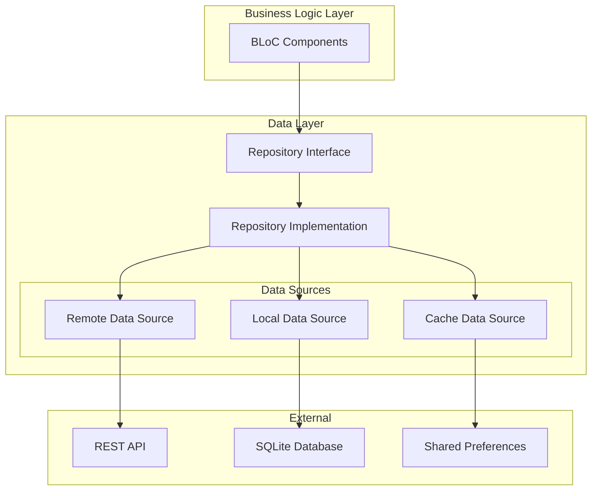

# Repository Pattern Implementation Guide

## Table of Contents
1. [Overview](#overview)
2. [Repository Architecture](#repository-architecture)
3. [Data Source Abstraction](#data-source-abstraction)
4. [Repository Implementation](#repository-implementation)
5. [Caching Strategies](#caching-strategies)
6. [Error Handling](#error-handling)
7. [Testing Repositories](#testing-repositories)
8. [Migration from Direct API Calls](#migration-from-direct-api-calls)
9. [Real-World Examples](#real-world-examples)
10. [Best Practices](#best-practices)

---

## Overview

The Repository pattern is a crucial part of Prodigy Pro v2.0's clean architecture. It provides an abstraction layer between the business logic (BLoCs) and data sources (API, local storage, cache), making the application more testable, maintainable, and flexible.

### Key Benefits
- **Abstraction**: Business logic doesn't depend on specific data sources
- **Testability**: Easy to mock data sources for testing
- **Flexibility**: Can switch between different data sources
- **Caching**: Centralized caching logic
- **Offline Support**: Fallback to local data when network is unavailable
- **Single Source of Truth**: Unified data access layer

### Repository vs Direct API Calls

| Aspect | Direct API Calls (v1.0) | Repository Pattern (v2.0) |
|--------|--------------------------|---------------------------|
| Data Access | Mixed throughout controllers | Centralized in repositories |
| Testing | Difficult to mock | Easy to mock interfaces |
| Caching | No unified strategy | Centralized caching |
| Offline Support | None | Built-in fallback mechanisms |
| Code Reusability | Low | High |
| Error Handling | Scattered | Centralized |

---

## Repository Architecture

### Architecture Overview



### Layer Responsibilities

1. **Repository Interface**: Defines contracts for data operations
2. **Repository Implementation**: Coordinates between different data sources
3. **Data Sources**: Handle specific data access (API, database, cache)
4. **External Services**: Actual storage/network services

---

## Data Source Abstraction

### 1. Data Source Interfaces

```dart
// data/datasources/user_data_source.dart
abstract class UserRemoteDataSource {
  Future<UserModel> loginWithEmail({
    required String email,
    required String password,
  });

  Future<void> sendOTP(String phoneNumber);

  Future<UserModel> verifyOTP({
    required String phoneNumber,
    required String otp,
  });

  Future<UserModel> getUserProfile(String userId);

  Future<void> updateUserProfile(UserModel user);
}

abstract class UserLocalDataSource {
  Future<UserModel?> getCachedUser();

  Future<void> cacheUser(UserModel user);

  Future<void> clearUserCache();

  Future<String?> getStoredToken();

  Future<void> storeToken(String token);
}
```

### 2. Remote Data Source Implementation

```dart
// data/datasources/user_remote_data_source_impl.dart
class UserRemoteDataSourceImpl implements UserRemoteDataSource {
  final NetworkService _networkService;

  UserRemoteDataSourceImpl(this._networkService);

  @override
  Future<UserModel> loginWithEmail({
    required String email,
    required String password,
  }) async {
    try {
      final response = await _networkService.post(
        endpoint: ApiEndPoints.loginWithEmailAndPassword,
        data: {
          'email': email,
          'password': password,
        },
      );

      if (response.data['success']) {
        return UserModel.fromJson(response.data['data']);
      } else {
        throw ServerException(
          message: response.data['msg'] ?? 'Login failed',
          statusCode: response.statusCode ?? 400,
        );
      }
    } on DioException catch (e) {
      throw NetworkException(
        message: _getNetworkErrorMessage(e),
        statusCode: e.response?.statusCode,
      );
    } catch (e) {
      throw ServerException(
        message: 'Unexpected error occurred',
        statusCode: 500,
      );
    }
  }

  @override
  Future<void> sendOTP(String phoneNumber) async {
    try {
      final response = await _networkService.post(
        endpoint: ApiEndPoints.sendOTP,
        data: {'phone_number': phoneNumber},
      );

      if (!response.data['success']) {
        throw ServerException(
          message: response.data['msg'] ?? 'Failed to send OTP',
          statusCode: response.statusCode ?? 400,
        );
      }
    } on DioException catch (e) {
      throw NetworkException(
        message: _getNetworkErrorMessage(e),
        statusCode: e.response?.statusCode,
      );
    }
  }

  String _getNetworkErrorMessage(DioException e) {
    switch (e.type) {
      case DioExceptionType.connectionTimeout:
        return 'Connection timeout. Please check your internet connection.';
      case DioExceptionType.receiveTimeout:
        return 'Server response timeout. Please try again.';
      case DioExceptionType.connectionError:
        return 'No internet connection. Please check your network.';
      default:
        return 'Network error occurred. Please try again.';
    }
  }
}
```

### 3. Local Data Source Implementation

```dart
// data/datasources/user_local_data_source_impl.dart
class UserLocalDataSourceImpl implements UserLocalDataSource {
  final DatabaseHelper _databaseHelper;
  final SharedPreferences _sharedPreferences;

  UserLocalDataSourceImpl(this._databaseHelper, this._sharedPreferences);

  @override
  Future<UserModel?> getCachedUser() async {
    try {
      final userJson = _sharedPreferences.getString(_userCacheKey);
      if (userJson != null) {
        return UserModel.fromJson(json.decode(userJson));
      }
      return null;
    } catch (e) {
      throw CacheException('Failed to retrieve cached user');
    }
  }

  @override
  Future<void> cacheUser(UserModel user) async {
    try {
      await _sharedPreferences.setString(
        _userCacheKey,
        json.encode(user.toJson()),
      );
    } catch (e) {
      throw CacheException('Failed to cache user data');
    }
  }

  @override
  Future<void> clearUserCache() async {
    try {
      await _sharedPreferences.remove(_userCacheKey);
      await _sharedPreferences.remove(_tokenKey);
    } catch (e) {
      throw CacheException('Failed to clear user cache');
    }
  }

  @override
  Future<String?> getStoredToken() async {
    try {
      return _sharedPreferences.getString(_tokenKey);
    } catch (e) {
      throw CacheException('Failed to retrieve stored token');
    }
  }

  @override
  Future<void> storeToken(String token) async {
    try {
      await _sharedPreferences.setString(_tokenKey, token);
    } catch (e) {
      throw CacheException('Failed to store token');
    }
  }

  static const String _userCacheKey = 'cached_user';
  static const String _tokenKey = 'auth_token';
}
```

---

## Repository Implementation

### 1. Repository Interface

```dart
// domain/repositories/user_repository.dart
abstract class UserRepository {
  Future<User> loginWithEmail({
    required String email,
    required String password,
  });

  Future<void> sendOTP(String phoneNumber);

  Future<User> verifyOTP({
    required String phoneNumber,
    required String otp,
  });

  Future<User> getCurrentUser();

  Future<void> updateUserProfile(User user);

  Future<void> logout();

  Future<bool> isUserLoggedIn();

  Stream<User?> get userStream;
}
```

### 2. Repository Implementation

```dart
// data/repositories/user_repository_impl.dart
class UserRepositoryImpl implements UserRepository {
  final UserRemoteDataSource _remoteDataSource;
  final UserLocalDataSource _localDataSource;
  final NetworkInfo _networkInfo;

  final StreamController<User?> _userController = StreamController.broadcast();

  UserRepositoryImpl({
    required UserRemoteDataSource remoteDataSource,
    required UserLocalDataSource localDataSource,
    required NetworkInfo networkInfo,
  })  : _remoteDataSource = remoteDataSource,
        _localDataSource = localDataSource,
        _networkInfo = networkInfo;

  @override
  Stream<User?> get userStream => _userController.stream;

  @override
  Future<User> loginWithEmail({
    required String email,
    required String password,
  }) async {
    if (await _networkInfo.isConnected) {
      try {
        final userModel = await _remoteDataSource.loginWithEmail(
          email: email,
          password: password,
        );

        // Cache user data locally
        await _localDataSource.cacheUser(userModel);
        await _localDataSource.storeToken(userModel.token);

        final user = userModel.toDomain();
        _userController.add(user);

        return user;
      } catch (e) {
        // If login fails, don't fall back to cache for security reasons
        rethrow;
      }
    } else {
      throw NetworkException(
        message: 'No internet connection. Please check your network.',
      );
    }
  }

  @override
  Future<void> sendOTP(String phoneNumber) async {
    if (await _networkInfo.isConnected) {
      await _remoteDataSource.sendOTP(phoneNumber);
    } else {
      throw NetworkException(
        message: 'No internet connection. Please check your network.',
      );
    }
  }

  @override
  Future<User> getCurrentUser() async {
    try {
      // First, try to get from cache
      final cachedUser = await _localDataSource.getCachedUser();
      if (cachedUser != null) {
        final user = cachedUser.toDomain();
        _userController.add(user);

        // If network is available, refresh user data in background
        if (await _networkInfo.isConnected) {
          _refreshUserInBackground(cachedUser.id);
        }

        return user;
      }

      // If no cache and network available, fetch from remote
      if (await _networkInfo.isConnected) {
        final token = await _localDataSource.getStoredToken();
        if (token != null) {
          final userModel = await _remoteDataSource.getUserProfile(token);
          await _localDataSource.cacheUser(userModel);

          final user = userModel.toDomain();
          _userController.add(user);
          return user;
        }
      }

      throw UserNotLoggedInException();
    } catch (e) {
      if (e is UserNotLoggedInException) rethrow;
      throw UserRetrievalException('Failed to get current user');
    }
  }

  @override
  Future<void> updateUserProfile(User user) async {
    final userModel = UserModel.fromDomain(user);

    if (await _networkInfo.isConnected) {
      try {
        await _remoteDataSource.updateUserProfile(userModel);
        await _localDataSource.cacheUser(userModel);
        _userController.add(user);
      } catch (e) {
        throw UserUpdateException('Failed to update user profile');
      }
    } else {
      // Queue for later sync when network is available
      await _queueForSync('update_profile', userModel.toJson());
      throw NetworkException(
        message: 'Changes saved locally. Will sync when connected.',
      );
    }
  }

  @override
  Future<void> logout() async {
    try {
      if (await _networkInfo.isConnected) {
        // Notify server about logout (optional)
        // await _remoteDataSource.logout();
      }

      // Clear local data
      await _localDataSource.clearUserCache();
      _userController.add(null);
    } catch (e) {
      // Even if server logout fails, clear local data
      await _localDataSource.clearUserCache();
      _userController.add(null);
    }
  }

  @override
  Future<bool> isUserLoggedIn() async {
    final token = await _localDataSource.getStoredToken();
    return token != null;
  }

  Future<void> _refreshUserInBackground(String userId) async {
    try {
      final userModel = await _remoteDataSource.getUserProfile(userId);
      await _localDataSource.cacheUser(userModel);
      _userController.add(userModel.toDomain());
    } catch (e) {
      // Silently fail for background refresh
      debugPrint('Background user refresh failed: $e');
    }
  }

  Future<void> _queueForSync(String action, Map<String, dynamic> data) async {
    // Implementation for offline sync queue
    // This would store pending operations to sync when network is available
  }

  @override
  void dispose() {
    _userController.close();
  }
}
```

---

## Caching Strategies

### 1. Time-Based Cache

```dart
class CacheManager {
  final SharedPreferences _prefs;

  CacheManager(this._prefs);

  Future<T?> get<T>(
    String key,
    T Function(Map<String, dynamic>) fromJson, {
    Duration? maxAge,
  }) async {
    try {
      final cachedData = _prefs.getString(key);
      final cacheTime = _prefs.getInt('${key}_timestamp');

      if (cachedData != null && cacheTime != null) {
        final cacheDateTime = DateTime.fromMillisecondsSinceEpoch(cacheTime);
        final now = DateTime.now();

        if (maxAge == null || now.difference(cacheDateTime) < maxAge) {
          return fromJson(json.decode(cachedData));
        }
      }

      return null;
    } catch (e) {
      return null;
    }
  }

  Future<void> set<T>(
    String key,
    T data,
    Map<String, dynamic> Function(T) toJson,
  ) async {
    await _prefs.setString(key, json.encode(toJson(data)));
    await _prefs.setInt('${key}_timestamp', DateTime.now().millisecondsSinceEpoch);
  }

  Future<void> remove(String key) async {
    await _prefs.remove(key);
    await _prefs.remove('${key}_timestamp');
  }
}
```

### 2. Repository with Cache Strategy

```dart
class PortfolioRepositoryImpl implements PortfolioRepository {
  final PortfolioRemoteDataSource _remoteDataSource;
  final PortfolioLocalDataSource _localDataSource;
  final CacheManager _cacheManager;
  final NetworkInfo _networkInfo;

  static const Duration _portfolioCacheDuration = Duration(minutes: 5);
  static const String _portfolioCacheKey = 'portfolio_data';

  @override
  Future<Portfolio> getPortfolio(String userId) async {
    // Try cache first
    final cachedPortfolio = await _cacheManager.get<PortfolioModel>(
      _portfolioCacheKey,
      PortfolioModel.fromJson,
      maxAge: _portfolioCacheDuration,
    );

    if (cachedPortfolio != null) {
      // Return cached data immediately
      final portfolio = cachedPortfolio.toDomain();

      // Refresh in background if network available
      if (await _networkInfo.isConnected) {
        _refreshPortfolioInBackground(userId);
      }

      return portfolio;
    }

    // No cache or expired, fetch from network
    if (await _networkInfo.isConnected) {
      try {
        final portfolioModel = await _remoteDataSource.getPortfolio(userId);

        // Cache the fresh data
        await _cacheManager.set(
          _portfolioCacheKey,
          portfolioModel,
          (model) => model.toJson(),
        );

        return portfolioModel.toDomain();
      } catch (e) {
        // Network failed, try local database as fallback
        final localPortfolio = await _localDataSource.getPortfolio(userId);
        if (localPortfolio != null) {
          return localPortfolio.toDomain();
        }
        rethrow;
      }
    } else {
      // Offline fallback
      final localPortfolio = await _localDataSource.getPortfolio(userId);
      if (localPortfolio != null) {
        return localPortfolio.toDomain();
      }

      throw NetworkException(
        message: 'No internet connection and no offline data available',
      );
    }
  }

  Future<void> _refreshPortfolioInBackground(String userId) async {
    try {
      final portfolioModel = await _remoteDataSource.getPortfolio(userId);
      await _cacheManager.set(
        _portfolioCacheKey,
        portfolioModel,
        (model) => model.toJson(),
      );
      await _localDataSource.savePortfolio(portfolioModel);
    } catch (e) {
      debugPrint('Background portfolio refresh failed: $e');
    }
  }
}
```

---

## Error Handling

### 1. Custom Exceptions

```dart
// core/exceptions/exceptions.dart
abstract class AppException implements Exception {
  final String message;
  final String? code;

  const AppException(this.message, {this.code});

  @override
  String toString() => message;
}

class NetworkException extends AppException {
  final int? statusCode;

  const NetworkException({
    required String message,
    this.statusCode,
    String? code,
  }) : super(message, code: code);
}

class ServerException extends AppException {
  final int statusCode;

  const ServerException({
    required String message,
    required this.statusCode,
    String? code,
  }) : super(message, code: code);
}

class CacheException extends AppException {
  const CacheException(String message) : super(message);
}

class ValidationException extends AppException {
  final Map<String, String>? fieldErrors;

  const ValidationException({
    required String message,
    this.fieldErrors,
    String? code,
  }) : super(message, code: code);
}
```

### 2. Error Handling in Repository

```dart
class CalculatorRepositoryImpl implements CalculatorRepository {
  @override
  Future<SipCalculatorResult> calculateSIP({
    required double monthlyAmount,
    required int period,
    required double rateOfReturn,
  }) async {
    try {
      // Validate input
      _validateSIPInput(monthlyAmount, period, rateOfReturn);

      if (await _networkInfo.isConnected) {
        try {
          // Try remote calculation first
          return await _remoteDataSource.calculateSIP(
            monthlyAmount: monthlyAmount,
            period: period,
            rateOfReturn: rateOfReturn,
          );
        } catch (e) {
          // If remote fails, fall back to local calculation
          return await _localDataSource.calculateSIP(
            monthlyAmount: monthlyAmount,
            period: period,
            rateOfReturn: rateOfReturn,
          );
        }
      } else {
        // No network, use local calculation
        return await _localDataSource.calculateSIP(
          monthlyAmount: monthlyAmount,
          period: period,
          rateOfReturn: rateOfReturn,
        );
      }
    } on ValidationException {
      rethrow;
    } catch (e) {
      throw CalculationException(
        message: 'Failed to calculate SIP. Please try again.',
      );
    }
  }

  void _validateSIPInputs(double amount, int period, double rate) {
    if (amount < 500 || amount > 1000000) {
      throw ValidationException(
        message: 'Monthly amount should be between ₹500 and ₹10,00,000',
      );
    }

    if (period < 1 || period > 30) {
      throw ValidationException(
        message: 'Investment period should be between 1 and 30 years',
      );
    }

    if (rate < 1 || rate > 50) {
      throw ValidationException(
        message: 'Rate of return should be between 1% and 50%',
      );
    }
  }
}
```

---

## Testing Repositories

### 1. Repository Testing Setup

```dart
// test/data/repositories/user_repository_impl_test.dart
import 'package:flutter_test/flutter_test.dart';
import 'package:mockito/mockito.dart';
import 'package:mockito/annotations.dart';

@GenerateMocks([
  UserRemoteDataSource,
  UserLocalDataSource,
  NetworkInfo,
])
import 'user_repository_impl_test.mocks.dart';

void main() {
  group('UserRepositoryImpl', () {
    late UserRepositoryImpl repository;
    late MockUserRemoteDataSource mockRemoteDataSource;
    late MockUserLocalDataSource mockLocalDataSource;
    late MockNetworkInfo mockNetworkInfo;

    setUp(() {
      mockRemoteDataSource = MockUserRemoteDataSource();
      mockLocalDataSource = MockUserLocalDataSource();
      mockNetworkInfo = MockNetworkInfo();

      repository = UserRepositoryImpl(
        remoteDataSource: mockRemoteDataSource,
        localDataSource: mockLocalDataSource,
        networkInfo: mockNetworkInfo,
      );
    });

    group('loginWithEmail', () {
      const testEmail = 'test@example.com';
      const testPassword = 'password123';
      final testUserModel = UserModel(
        id: '1',
        email: testEmail,
        name: 'Test User',
        token: 'test_token',
      );
      final testUser = testUserModel.toDomain();

      test(
        'should return User when login succeeds with network connection',
        () async {
          // arrange
          when(mockNetworkInfo.isConnected).thenAnswer((_) async => true);
          when(mockRemoteDataSource.loginWithEmail(
            email: anyNamed('email'),
            password: anyNamed('password'),
          )).thenAnswer((_) async => testUserModel);
          when(mockLocalDataSource.cacheUser(any)).thenAnswer((_) async {});
          when(mockLocalDataSource.storeToken(any)).thenAnswer((_) async {});

          // act
          final result = await repository.loginWithEmail(
            email: testEmail,
            password: testPassword,
          );

          // assert
          expect(result, equals(testUser));
          verify(mockRemoteDataSource.loginWithEmail(
            email: testEmail,
            password: testPassword,
          ));
          verify(mockLocalDataSource.cacheUser(testUserModel));
          verify(mockLocalDataSource.storeToken(testUserModel.token));
        },
      );

      test(
        'should throw NetworkException when no internet connection',
        () async {
          // arrange
          when(mockNetworkInfo.isConnected).thenAnswer((_) async => false);

          // act & assert
          expect(
            () => repository.loginWithEmail(
              email: testEmail,
              password: testPassword,
            ),
            throwsA(isA<NetworkException>()),
          );

          verifyNever(mockRemoteDataSource.loginWithEmail(
            email: anyNamed('email'),
            password: anyNamed('password'),
          ));
        },
      );
    });

    group('getCurrentUser', () {
      final testUserModel = UserModel(
        id: '1',
        email: 'test@example.com',
        name: 'Test User',
        token: 'test_token',
      );
      final testUser = testUserModel.toDomain();

      test(
        'should return cached user when available',
        () async {
          // arrange
          when(mockLocalDataSource.getCachedUser())
              .thenAnswer((_) async => testUserModel);
          when(mockNetworkInfo.isConnected).thenAnswer((_) async => true);

          // act
          final result = await repository.getCurrentUser();

          // assert
          expect(result, equals(testUser));
          verify(mockLocalDataSource.getCachedUser());
        },
      );
    });
  });
}
```

### 2. Data Source Testing

```dart
// test/data/datasources/user_remote_data_source_impl_test.dart
void main() {
  group('UserRemoteDataSourceImpl', () {
    late UserRemoteDataSourceImpl dataSource;
    late MockNetworkService mockNetworkService;

    setUp(() {
      mockNetworkService = MockNetworkService();
      dataSource = UserRemoteDataSourceImpl(mockNetworkService);
    });

    group('loginWithEmail', () {
      test(
        'should return UserModel when login request succeeds',
        () async {
          // arrange
          final responseData = {
            'success': true,
            'data': {
              'id': '1',
              'email': 'test@example.com',
              'name': 'Test User',
              'token': 'test_token',
            },
          };

          when(mockNetworkService.post(
            endpoint: anyNamed('endpoint'),
            data: anyNamed('data'),
          )).thenAnswer((_) async => Response(
            data: responseData,
            statusCode: 200,
            requestOptions: RequestOptions(path: ''),
          ));

          // act
          final result = await dataSource.loginWithEmail(
            email: 'test@example.com',
            password: 'password123',
          );

          // assert
          expect(result, isA<UserModel>());
          expect(result.email, equals('test@example.com'));
          verify(mockNetworkService.post(
            endpoint: ApiEndPoints.loginWithEmailAndPassword,
            data: {
              'email': 'test@example.com',
              'password': 'password123',
            },
          ));
        },
      );
    });
  });
}
```

---

## Migration from Direct API Calls

### Migration Strategy

#### 1. **Before: Direct API Calls in Controllers (GetX Pattern)**

Current implementation in `lib/controllers/user_controller.dart`:

```dart
// Before: Direct API calls in GetX Controller
class UserController extends GetxController {
  static var isLoading = false.obs;

  static void loginWithEmailAndPassword(
    BuildContext context,
    LoginWithEmailAndPasswordRequestModel userData,
  ) async {
    LoginWithEmailAndPasswordResponseModel? res;

    try {
      isLoading(true);
      final result = await NetworkCall().makeRequest(
        url: ApiEndPoints.loginWithEmailAndPassword,
        method: Method.post,
        params: userData.toJson(),
      );

      if (result != null) {
        if (result is d.Response) {
          res = LoginWithEmailAndPasswordResponseModel.fromJson(result.data);
          if (res.success) {
            await LocalUserInfoController.updateUserToken(res.data);
            await UserController.setUserStatus();
            await LocalUserInfoController.updateLoggedInStatus(true);
            // Navigation logic mixed with data logic
            Navigator.pushNamedAndRemoveUntil(
              context,
              DashboardScreen.routeName,
              (Route<dynamic> route) => false,
            );
          }
        }
      }
    } on d.DioException catch (e) {
      if (e.response?.data['msg'] != null) {
        GenericWidget.showSnackBar(
          title: e.response?.data['msg'],
        );
      }
    } finally {
      isLoading(false);
    }
  }
}
```

#### 2. **After: Repository Pattern with BLoC**

```dart
// Step 1: Create Repository Interface
abstract class AuthRepository {
  Future<AuthResult> loginWithEmail({
    required String email,
    required String password,
  });

  Future<void> logout();
  Future<bool> isUserLoggedIn();
}

// Step 2: Implement Repository
class AuthRepositoryImpl implements AuthRepository {
  final AuthRemoteDataSource _remoteDataSource;
  final AuthLocalDataSource _localDataSource;
  final NetworkInfo _networkInfo;

  AuthRepositoryImpl({
    required AuthRemoteDataSource remoteDataSource,
    required AuthLocalDataSource localDataSource,
    required NetworkInfo networkInfo,
  })  : _remoteDataSource = remoteDataSource,
        _localDataSource = localDataSource,
        _networkInfo = networkInfo;

  @override
  Future<AuthResult> loginWithEmail({
    required String email,
    required String password,
  }) async {
    if (await _networkInfo.isConnected) {
      try {
        final authModel = await _remoteDataSource.loginWithEmail(
          email: email,
          password: password,
        );

        // Cache authentication data
        await _localDataSource.saveAuthData(authModel);

        return authModel.toDomain();
      } catch (e) {
        rethrow;
      }
    } else {
      throw NetworkException(
        message: 'No internet connection available',
      );
    }
  }
}

// Step 3: Use Repository in BLoC
class AuthBloc extends Bloc<AuthEvent, AuthState> {
  final AuthRepository _authRepository;

  AuthBloc(this._authRepository) : super(AuthInitial()) {
    on<LoginRequested>(_onLoginRequested);
  }

  Future<void> _onLoginRequested(
    LoginRequested event,
    Emitter<AuthState> emit,
  ) async {
    try {
      emit(AuthLoading());

      final authResult = await _authRepository.loginWithEmail(
        email: event.email,
        password: event.password,
      );

      emit(AuthSuccess(authResult: authResult));
    } catch (error) {
      emit(AuthError(message: _getErrorMessage(error)));
    }
  }
}
```

---

## Real-World Examples

### Example 1: Portfolio Repository

Based on the current codebase patterns, here's how to migrate portfolio management:

```dart
// domain/repositories/portfolio_repository.dart
abstract class PortfolioRepository {
  Future<Portfolio> getPortfolio(String userId);
  Future<List<Fund>> getUserFunds(String userId);
  Future<PortfolioPerformance> getPerformanceData({
    required String userId,
    required DateRange dateRange,
  });
  Future<void> refreshPortfolio(String userId);
}

// data/repositories/portfolio_repository_impl.dart
class PortfolioRepositoryImpl implements PortfolioRepository {
  final PortfolioRemoteDataSource _remoteDataSource;
  final PortfolioLocalDataSource _localDataSource;
  final CacheManager _cacheManager;
  final NetworkInfo _networkInfo;

  PortfolioRepositoryImpl({
    required PortfolioRemoteDataSource remoteDataSource,
    required PortfolioLocalDataSource localDataSource,
    required CacheManager cacheManager,
    required NetworkInfo networkInfo,
  })  : _remoteDataSource = remoteDataSource,
        _localDataSource = localDataSource,
        _cacheManager = cacheManager,
        _networkInfo = networkInfo;

  @override
  Future<Portfolio> getPortfolio(String userId) async {
    // Cache-first strategy with network refresh
    final cacheKey = 'portfolio_$userId';

    try {
      // Try cache first
      final cachedPortfolio = await _cacheManager.get<PortfolioModel>(
        cacheKey,
        PortfolioModel.fromJson,
        maxAge: Duration(minutes: 5),
      );

      if (cachedPortfolio != null) {
        // Return cached data and refresh in background
        if (await _networkInfo.isConnected) {
          _refreshPortfolioInBackground(userId);
        }
        return cachedPortfolio.toDomain();
      }

      // No cache, fetch from network
      if (await _networkInfo.isConnected) {
        final portfolioModel = await _remoteDataSource.getPortfolio(userId);

        // Cache for future use
        await _cacheManager.set(cacheKey, portfolioModel, (p) => p.toJson());
        await _localDataSource.savePortfolio(portfolioModel);

        return portfolioModel.toDomain();
      } else {
        // Offline fallback
        final localPortfolio = await _localDataSource.getPortfolio(userId);
        if (localPortfolio != null) {
          return localPortfolio.toDomain();
        }

        throw NetworkException(
          message: 'No internet connection and no offline data available',
        );
      }
    } catch (e) {
      if (e is NetworkException) rethrow;
      throw PortfolioException('Failed to retrieve portfolio data');
    }
  }
}
```

### Example 2: Calculator Repository

Migrating the existing calculator logic to repository pattern:

```dart
// domain/repositories/calculator_repository.dart
abstract class CalculatorRepository {
  Future<SipCalculatorResult> calculateSIP({
    required double monthlyAmount,
    required int period,
    required double rateOfReturn,
  });

  Future<RetirementCalculatorResult> calculateRetirement({
    required int currentAge,
    required int retirementAge,
    required double currentSavings,
    required double monthlyContribution,
    required double expectedReturn,
  });

  Future<List<CalculatorHistory>> getCalculatorHistory(String userId);
  Future<void> saveCalculatorResult(CalculatorResult result);
}

// data/repositories/calculator_repository_impl.dart
class CalculatorRepositoryImpl implements CalculatorRepository {
  final CalculatorRemoteDataSource _remoteDataSource;
  final CalculatorLocalDataSource _localDataSource;
  final NetworkInfo _networkInfo;

  @override
  Future<SipCalculatorResult> calculateSIP({
    required double monthlyAmount,
    required int period,
    required double rateOfReturn,
  }) async {
    try {
      // Validate inputs
      _validateSIPInputs(monthlyAmount, period, rateOfReturn);

      SipCalculatorResultModel result;

      if (await _networkInfo.isConnected) {
        try {
          // Try server-side calculation for more accuracy
          result = await _remoteDataSource.calculateSIP(
            monthlyAmount: monthlyAmount,
            period: period,
            rateOfReturn: rateOfReturn,
          );
        } catch (e) {
          // Fallback to local calculation
          result = await _localDataSource.calculateSIP(
            monthlyAmount: monthlyAmount,
            period: period,
            rateOfReturn: rateOfReturn,
          );
        }
      } else {
        // Offline calculation
        result = await _localDataSource.calculateSIP(
          monthlyAmount: monthlyAmount,
          period: period,
          rateOfReturn: rateOfReturn,
        );
      }

      // Save to history if user is logged in
      await _saveToHistory(result);

      return result.toDomain();
    } catch (e) {
      if (e is ValidationException) rethrow;
      throw CalculatorException('Failed to calculate SIP');
    }
  }

  void _validateSIPInputs(double amount, int period, double rate) {
    if (amount < 500 || amount > 1000000) {
      throw ValidationException(
        message: 'Monthly amount should be between ₹500 and ₹10,00,000',
      );
    }

    if (period < 1 || period > 30) {
      throw ValidationException(
        message: 'Investment period should be between 1 and 30 years',
      );
    }

    if (rate < 1 || rate > 50) {
      throw ValidationException(
        message: 'Rate of return should be between 1% and 50%',
      );
    }
  }
}
```

---

## Best Practices

### 1. **Repository Design Principles**

```dart
// Good: Single responsibility
abstract class UserRepository {
  Future<User> getUser(String id);
  Future<void> updateUser(User user);
  Future<void> deleteUser(String id);
}

// Bad: Mixed responsibilities
abstract class AppRepository {
  Future<User> getUser(String id);
  Future<Portfolio> getPortfolio(String userId);
  Future<List<Fund>> getFunds();
  // Too many unrelated methods
}
```

### 2. **Error Handling Strategy**

```dart
class BaseRepository {
  Future<T> handleNetworkCall<T>(
    Future<T> Function() networkCall,
    Future<T?> Function()? cacheCall,
  ) async {
    try {
      if (await _networkInfo.isConnected) {
        return await networkCall();
      } else {
        if (cacheCall != null) {
          final cached = await cacheCall();
          if (cached != null) return cached;
        }
        throw NetworkException(message: 'No internet connection');
      }
    } catch (e) {
      if (cacheCall != null && e is! NetworkException) {
        final cached = await cacheCall();
        if (cached != null) return cached;
      }
      rethrow;
    }
  }
}
```

### 3. **Caching Best Practices**

```dart
class CacheStrategy {
  static const Duration shortTerm = Duration(minutes: 5);  // Real-time data
  static const Duration mediumTerm = Duration(hours: 1);   // Semi-static data
  static const Duration longTerm = Duration(days: 1);      // Static data

  static Duration getCacheDuration(DataType type) {
    switch (type) {
      case DataType.portfolio:
        return shortTerm;
      case DataType.fundList:
        return mediumTerm;
      case DataType.kycDocuments:
        return longTerm;
    }
  }
}
```

### 4. **Repository Interface Design**

```dart
// Good: Clear method signatures with proper types
abstract class FundRepository {
  Future<List<Fund>> getFunds({
    FundCategory? category,
    SortOrder sortOrder = SortOrder.name,
  });

  Future<Fund> getFundDetails(String fundId);

  Future<List<Fund>> searchFunds(String query);

  Stream<List<Fund>> watchFunds();
}

// Bad: Unclear or overly generic methods
abstract class FundRepository {
  Future<dynamic> getData(String type);
  Future<void> doSomething(Map<String, dynamic> params);
}
```

---

## Performance Optimization

### 1. **Lazy Loading Strategy**

```dart
class FundRepositoryImpl implements FundRepository {
  List<Fund>? _cachedFunds;

  @override
  Future<List<Fund>> getFunds({
    FundCategory? category,
    SortOrder sortOrder = SortOrder.name,
  }) async {
    // Return cached data immediately if available
    if (_cachedFunds != null) {
      final filtered = _filterAndSort(_cachedFunds!, category, sortOrder);

      // Refresh in background
      _refreshFundsInBackground();

      return filtered;
    }

    // First load: fetch from network/cache
    return await _fetchFunds(category, sortOrder);
  }

  Future<void> _refreshFundsInBackground() async {
    try {
      final freshFunds = await _remoteDataSource.getFunds();
      _cachedFunds = freshFunds.map((f) => f.toDomain()).toList();
      await _localDataSource.saveFunds(freshFunds);
    } catch (e) {
      // Silent fail for background refresh
    }
  }
}
```

### 2. **Batch Operations**

```dart
abstract class TransactionRepository {
  Future<List<Transaction>> getTransactions(String userId);

  // Batch operations for better performance
  Future<void> syncPendingTransactions(List<Transaction> transactions);
  Future<Map<String, TransactionStatus>> getTransactionStatuses(
    List<String> transactionIds,
  );
}
```

---

*This repository pattern guide provides the foundation for implementing a robust, testable, and maintainable data layer in Prodigy Pro v2.0. All data access should go through repositories to ensure consistency and proper separation of concerns.*
