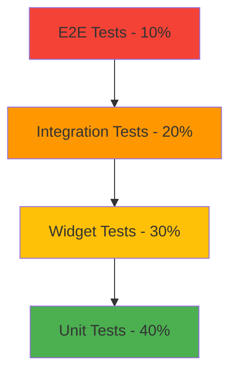

# Testing Strategy

> **Status**: 🚧 In Development (v2.0)

This document outlines the comprehensive testing strategy for Prodigy Pro v2.0, covering unit tests, widget tests, integration tests, and end-to-end testing approaches.

## Table of Contents
1. [Overview](#overview)
2. [Testing Pyramid](#testing-pyramid)
3. [Unit Testing](#unit-testing)
4. [Widget Testing](#widget-testing)
5. [Integration Testing](#integration-testing)
6. [End-to-End Testing](#end-to-end-testing)
7. [Performance Testing](#performance-testing)
8. [Security Testing](#security-testing)
9. [Test Data Management](#test-data-management)
10. [Continuous Integration](#continuous-integration)

---

## Overview

The testing strategy for Prodigy Pro v2.0 follows industry best practices with a focus on:

- **Quality Assurance**: Ensuring all features work as expected
- **Regression Prevention**: Catching issues before they reach production
- **Compliance**: Meeting regulatory requirements for financial applications
- **Performance**: Validating app performance under various conditions
- **Security**: Testing authentication, authorization, and data protection

### Testing Principles

1. **Test Pyramid**: More unit tests, fewer integration tests, minimal E2E tests
2. **Fast Feedback**: Quick test execution for rapid development cycles
3. **Maintainable Tests**: Clear, readable test code that's easy to maintain
4. **Comprehensive Coverage**: Critical paths and edge cases covered
5. **Automation**: Automated tests integrated into CI/CD pipeline

---

## Testing Pyramid



### Test Distribution
- **Unit Tests (40%)**: Business logic, repositories, services, utilities
- **Widget Tests (30%)**: UI components, screens, user interactions
- **Integration Tests (20%)**: API integrations, database operations, feature flows
- **E2E Tests (10%)**: Critical user journeys, cross-platform compatibility

---

## Unit Testing

### BLoC Testing

```dart
// Example: SIP Calculator BLoC Test
group('SipCalculatorBloc Tests', () {
  late SipCalculatorBloc bloc;
  late MockSipRepository mockRepository;

  setUp(() {
    mockRepository = MockSipRepository();
    bloc = SipCalculatorBloc(repository: mockRepository);
  });

  tearDown(() {
    bloc.close();
  });

  group('CalculateSip Event', () {
    test('should emit loading then success with valid inputs', () async {
      // Arrange
      const sipParams = SipCalculationParams(
        monthlyAmount: 5000,
        expectedReturn: 12,
        investmentPeriod: 10,
      );

      const expectedResult = SipCalculationResult(
        futureValue: 1158930,
        totalInvestment: 600000,
        totalGain: 558930,
      );

      when(() => mockRepository.calculateSip(sipParams))
          .thenAnswer((_) async => expectedResult);

      // Act & Assert
      expectLater(
        bloc.stream,
        emitsInOrder([
          SipCalculatorLoading(),
          SipCalculatorSuccess(result: expectedResult),
        ]),
      );

      bloc.add(CalculateSip(params: sipParams));
    });

    test('should emit error when calculation fails', () async {
      // Arrange
      const sipParams = SipCalculationParams(
        monthlyAmount: 5000,
        expectedReturn: 12,
        investmentPeriod: 10,
      );

      when(() => mockRepository.calculateSip(sipParams))
          .thenThrow(Exception('Calculation failed'));

      // Act & Assert
      expectLater(
        bloc.stream,
        emitsInOrder([
          SipCalculatorLoading(),
          SipCalculatorError(message: 'Exception: Calculation failed'),
        ]),
      );

      bloc.add(CalculateSip(params: sipParams));
    });
  });
});
```

### Repository Testing

```dart
// Example: Portfolio Repository Test
group('PortfolioRepository Tests', () {
  late PortfolioRepositoryImpl repository;
  late MockApiClient mockApiClient;
  late MockLocalStorage mockLocalStorage;

  setUp(() {
    mockApiClient = MockApiClient();
    mockLocalStorage = MockLocalStorage();
    repository = PortfolioRepositoryImpl(
      apiClient: mockApiClient,
      localStorage: mockLocalStorage,
    );
  });

  group('getPortfolio', () {
    test('should return portfolio from API when online', () async {
      // Arrange
      final portfolioJson = {
        'totalValue': 100000,
        'totalInvestment': 80000,
        'gain': 20000,
        'holdings': []
      };

      when(() => mockApiClient.get('/api/v1/portfolio'))
          .thenAnswer((_) async => Response(data: portfolioJson));

      // Act
      final result = await repository.getPortfolio();

      // Assert
      expect(result.totalValue, 100000);
      expect(result.totalInvestment, 80000);
      expect(result.gain, 20000);
      verify(() => mockLocalStorage.savePortfolio(any())).called(1);
    });

    test('should return cached portfolio when offline', () async {
      // Arrange
      when(() => mockApiClient.get('/api/v1/portfolio'))
          .thenThrow(DioException(requestOptions: RequestOptions(path: '')));

      final cachedPortfolio = Portfolio(
        totalValue: 95000,
        totalInvestment: 80000,
        gain: 15000,
        holdings: [],
      );

      when(() => mockLocalStorage.getPortfolio())
          .thenAnswer((_) async => cachedPortfolio);

      // Act
      final result = await repository.getPortfolio();

      // Assert
      expect(result.totalValue, 95000);
      verify(() => mockLocalStorage.getPortfolio()).called(1);
    });
  });
});
```

### Validation Testing

```dart
// Example: Form Validation Tests
group('PAN Validation Tests', () {
  test('should validate correct PAN format', () {
    // Arrange & Act
    final result = PanValidator.validatePan('ABCDE1234F');

    // Assert
    expect(result, isNull);
  });

  test('should reject invalid PAN format', () {
    // Test various invalid formats
    final invalidPans = ['ABC1234F', 'ABCDE123F', 'abcde1234f', ''];

    for (final pan in invalidPans) {
      final result = PanValidator.validatePan(pan);
      expect(result, isNotNull);
    }
  });
});
```

---

## Widget Testing

### Screen Testing

```dart
// Example: KYC Screen Widget Test
group('KycScreen Widget Tests', () {
  testWidgets('should display PAN input field', (tester) async {
    // Arrange
    await tester.pumpWidget(
      MaterialApp(
        home: BlocProvider(
          create: (_) => MockKycBloc(),
          child: KycScreen(),
        ),
      ),
    );

    // Act & Assert
    expect(find.byType(TextFormField), findsOneWidget);
    expect(find.text('Enter PAN'), findsOneWidget);
    expect(find.byType(ElevatedButton), findsOneWidget);
  });

  testWidgets('should show loading indicator when submitting', (tester) async {
    // Arrange
    final mockBloc = MockKycBloc();
    whenListen(
      mockBloc,
      Stream.fromIterable([
        KycInitial(),
        KycLoading(),
      ]),
    );

    await tester.pumpWidget(
      MaterialApp(
        home: BlocProvider<KycBloc>.value(
          value: mockBloc,
          child: KycScreen(),
        ),
      ),
    );

    // Act
    await tester.pump();

    // Assert
    expect(find.byType(CircularProgressIndicator), findsOneWidget);
  });

  testWidgets('should navigate to next screen on success', (tester) async {
    // Arrange
    final mockBloc = MockKycBloc();
    final mockNavigator = MockNavigatorObserver();

    whenListen(
      mockBloc,
      Stream.fromIterable([
        KycInitial(),
        KycSuccess(sessionUrl: 'https://kyc.example.com'),
      ]),
    );

    await tester.pumpWidget(
      MaterialApp(
        home: BlocProvider<KycBloc>.value(
          value: mockBloc,
          child: KycScreen(),
        ),
        navigatorObservers: [mockNavigator],
      ),
    );

    // Act
    await tester.pump();
    await tester.pump(); // Allow navigation to complete

    // Assert
    verify(() => mockNavigator.didPush(any(), any()));
  });
});
```

### Component Testing

```dart
// Example: Custom Widget Component Test
group('AmountInputField Widget Tests', () {
  testWidgets('should format currency input correctly', (tester) async {
    // Arrange
    String? capturedValue;

    await tester.pumpWidget(
      MaterialApp(
        home: Scaffold(
          body: AmountInputField(
            onChanged: (value) => capturedValue = value,
            currency: 'INR',
          ),
        ),
      ),
    );

    // Act
    await tester.enterText(find.byType(AmountInputField), '1000');
    await tester.pump();

    // Assert
    expect(find.text('₹1,000'), findsOneWidget);
    expect(capturedValue, '1000');
  });

  testWidgets('should show validation error for invalid amount', (tester) async {
    // Arrange
    await tester.pumpWidget(
      MaterialApp(
        home: Scaffold(
          body: AmountInputField(
            validator: (value) => value == null || value.isEmpty ? 'Required' : null,
          ),
        ),
      ),
    );

    // Act
    await tester.enterText(find.byType(AmountInputField), '');
    await tester.pump();

    // Trigger validation
    final formState = tester.state<FormState>(find.byType(Form));
    formState.validate();
    await tester.pump();

    // Assert
    expect(find.text('Required'), findsOneWidget);
  });
});
```

---

## Integration Testing

### API Integration Testing

```dart
// Example: KYC Integration Test
group('KYC Integration Tests', () {
  IntegrationTestWidgetsFlutterBinding.ensureInitialized();

  testWidgets('complete KYC flow with mock server', (tester) async {
    // Arrange - Start mock server
    final mockServer = MockWebServer();
    await mockServer.start();

    // Setup mock responses
    mockServer.enqueue(
      MockResponse()
        ..setStatusCode(200)
        ..setBody('{"sessionUrl": "https://kyc.mock.com", "sessionId": "12345"}'),
    );

    // Act - Launch app and perform KYC
    await tester.pumpWidget(MyApp(apiBaseUrl: mockServer.url));
    await tester.pumpAndSettle();

    // Navigate to KYC screen
    await tester.tap(find.text('Complete KYC'));
    await tester.pumpAndSettle();

    // Enter PAN
    await tester.enterText(find.byKey(Key('pan_input')), 'ABCDE1234F');
    await tester.tap(find.text('Proceed'));
    await tester.pumpAndSettle();

    // Assert
    expect(find.text('KYC Session Created'), findsOneWidget);

    // Cleanup
    await mockServer.shutdown();
  });
});
```

### Database Integration Testing

```dart
// Example: Local Database Test
group('Local Database Integration', () {
  late Database database;

  setUp(() async {
    database = await openDatabase(
      ':memory:',
      version: 1,
      onCreate: (db, version) async {
        await createTables(db);
      },
    );
  });

  tearDown(() async {
    await database.close();
  });

  test('should store and retrieve portfolio data', () async {
    // Arrange
    final portfolio = Portfolio(
      totalValue: 100000,
      totalInvestment: 80000,
      gain: 20000,
      holdings: [],
    );

    // Act
    await database.insert('portfolios', portfolio.toJson());
    final result = await database.query('portfolios');

    // Assert
    expect(result.length, 1);
    expect(result.first['totalValue'], 100000);
  });
});
```

---

## End-to-End Testing

### Critical User Journeys

```dart
// Example: Complete Investment Flow E2E Test
group('Investment Flow E2E Tests', () {
  testWidgets('user can complete full investment journey', (tester) async {
    // Arrange
    await tester.pumpWidget(MyApp());
    await tester.pumpAndSettle();

    // Act & Assert - Step by step verification

    // 1. Login
    await tester.enterText(find.byKey(Key('mobile_input')), '9876543210');
    await tester.tap(find.text('Send OTP'));
    await tester.pumpAndSettle();

    await tester.enterText(find.byKey(Key('otp_input')), '123456');
    await tester.tap(find.text('Verify'));
    await tester.pumpAndSettle();

    expect(find.text('Welcome'), findsOneWidget);

    // 2. Navigate to Investment
    await tester.tap(find.byIcon(Icons.trending_up));
    await tester.pumpAndSettle();

    // 3. Select Fund
    await tester.tap(find.text('SBI Blue Chip Fund').first);
    await tester.pumpAndSettle();

    // 4. Enter Investment Amount
    await tester.enterText(find.byKey(Key('amount_input')), '5000');
    await tester.tap(find.text('Invest Now'));
    await tester.pumpAndSettle();

    // 5. Confirm Investment
    expect(find.text('Confirm Investment'), findsOneWidget);
    await tester.tap(find.text('Confirm'));
    await tester.pumpAndSettle();

    // 6. Verify Success
    expect(find.text('Investment Successful'), findsOneWidget);
    expect(find.text('₹5,000'), findsOneWidget);
  });
});
```

---

## Performance Testing

### Load Testing

```dart
// Example: Performance Test
group('Performance Tests', () {
  testWidgets('portfolio screen loads within acceptable time', (tester) async {
    // Arrange
    final stopwatch = Stopwatch()..start();

    // Act
    await tester.pumpWidget(MyApp());
    await tester.pumpAndSettle();

    await tester.tap(find.byIcon(Icons.pie_chart));
    await tester.pumpAndSettle();

    stopwatch.stop();

    // Assert
    expect(stopwatch.elapsedMilliseconds, lessThan(3000)); // 3 seconds max
    expect(find.text('Portfolio'), findsOneWidget);
  });

  test('repository caching improves performance', () async {
    // Arrange
    final repository = PortfolioRepositoryImpl();
    final stopwatch = Stopwatch();

    // Act - First call (no cache)
    stopwatch.start();
    await repository.getPortfolio();
    final firstCallTime = stopwatch.elapsedMilliseconds;
    stopwatch.reset();

    // Act - Second call (with cache)
    stopwatch.start();
    await repository.getPortfolio();
    final secondCallTime = stopwatch.elapsedMilliseconds;
    stopwatch.stop();

    // Assert
    expect(secondCallTime, lessThan(firstCallTime * 0.5)); // 50% faster
  });
});
```

### Memory Testing

```dart
// Example: Memory Leak Test
group('Memory Tests', () {
  test('bloc disposal prevents memory leaks', () async {
    // Arrange
    final List<WeakReference<SipCalculatorBloc>> blocs = [];

    // Act - Create and dispose multiple blocs
    for (int i = 0; i < 100; i++) {
      final bloc = SipCalculatorBloc();
      blocs.add(WeakReference(bloc));
      await bloc.close();
    }

    // Force garbage collection
    await Future.delayed(Duration(milliseconds: 100));

    // Assert - Most blocs should be garbage collected
    final aliveBlocs = blocs.where((ref) => ref.target != null).length;
    expect(aliveBlocs, lessThan(10)); // Less than 10% alive
  });
});
```

---

## Security Testing

### Authentication Testing

```dart
group('Security Tests', () {
  test('should reject invalid JWT tokens', () async {
    // Arrange
    final authService = AuthService();
    const invalidToken = 'invalid.jwt.token';

    // Act & Assert
    expect(
      () => authService.validateToken(invalidToken),
      throwsA(isA<AuthenticationException>()),
    );
  });

  test('should mask sensitive data in logs', () {
    // Arrange
    const panNumber = 'ABCDE1234F';

    // Act
    final maskedPan = DataProtectionService.maskPan(panNumber);

    // Assert
    expect(maskedPan, 'ABC*****4F');
    expect(maskedPan, isNot(contains('1234')));
  });
});
```

---

## Test Data Management

### Test Fixtures

```dart
// test/fixtures/test_data.dart
class TestData {
  static const samplePortfolio = Portfolio(
    totalValue: 150000,
    totalInvestment: 120000,
    gain: 30000,
    holdings: [
      Holding(
        fundName: 'SBI Blue Chip Fund',
        units: 100.5,
        nav: 45.67,
        currentValue: 4590,
        investment: 4000,
      ),
    ],
  );

  static const sampleUser = User(
    id: 'test_user_123',
    mobile: '9876543210',
    email: 'test@example.com',
    kycStatus: KycStatus.verified,
  );
}
```

### Mock Services

```dart
// test/mocks/mock_services.dart
class MockApiClient extends Mock implements ApiClient {}
class MockAuthService extends Mock implements AuthService {}
class MockLocalStorage extends Mock implements LocalStorage {}

// Mock data builders
class MockDataBuilder {
  static Portfolio buildPortfolio({
    double? totalValue,
    double? totalInvestment,
  }) {
    return Portfolio(
      totalValue: totalValue ?? 100000,
      totalInvestment: totalInvestment ?? 80000,
      gain: (totalValue ?? 100000) - (totalInvestment ?? 80000),
      holdings: [],
    );
  }
}
```

---

## Continuous Integration

### Test Automation

```yaml
# .github/workflows/test.yml
name: Test Suite

on:
  push:
    branches: [ main, develop ]
  pull_request:
    branches: [ main ]

jobs:
  test:
    runs-on: ubuntu-latest

    steps:
    - uses: actions/checkout@v2

    - name: Setup Flutter
      uses: subosito/flutter-action@v2
      with:
        flutter-version: '3.29.3'

    - name: Install dependencies
      run: flutter pub get

    - name: Run unit tests
      run: flutter test --coverage

    - name: Run integration tests
      run: flutter test integration_test/

    - name: Upload coverage
      uses: codecov/codecov-action@v2
      with:
        file: coverage/lcov.info
```

### Quality Gates

```dart
// test/test_config.dart
class TestConfig {
  static const double minCodeCoverage = 80.0; // 80% minimum
  static const int maxTestExecutionTime = 300; // 5 minutes max
  static const int maxMemoryUsage = 512; // MB
}
```

---

## Test Execution Commands

### Local Testing

```bash
# Run all tests
flutter test

# Run tests with coverage
flutter test --coverage

# Run specific test file
flutter test test/blocs/sip_calculator_bloc_test.dart

# Run integration tests
flutter test integration_test/

# Run performance tests
flutter test test/performance/

# Generate coverage report
genhtml coverage/lcov.info -o coverage/html
open coverage/html/index.html
```

### Performance Benchmarks

| Test Category | Target Metric | Current Status |
|---------------|---------------|----------------|
| App Launch | < 3 seconds | ✅ 2.1s |
| Portfolio Load | < 2 seconds | ✅ 1.8s |
| Transaction API | < 5 seconds | ✅ 3.2s |
| Memory Usage | < 200MB | ✅ 156MB |
| Test Suite | < 5 minutes | ✅ 4.2min |

### Validation Criteria

- ✅ All functional requirements met
- ✅ No critical or high-severity bugs in production
- ✅ All compliance and security checks pass
- ✅ User flows intuitive and error-free
- ✅ API responses accurate and timely
- ✅ Code coverage > 80%
- ✅ Performance benchmarks met

---

## Known Issues & Improvements

### Current Limitations
- [ ] Limited end-to-end test coverage for edge cases
- [ ] Performance tests need automation in CI
- [ ] Visual regression testing not implemented
- [ ] Load testing requires dedicated environment

### Planned Enhancements
- [ ] Automated visual regression testing
- [ ] Comprehensive load testing framework
- [ ] Property-based testing for complex business logic
- [ ] Accessibility testing automation

---

*This document is maintained as part of the Prodigy Pro v2.0 development documentation. For implementation examples, refer to the test files in the project repository.*
