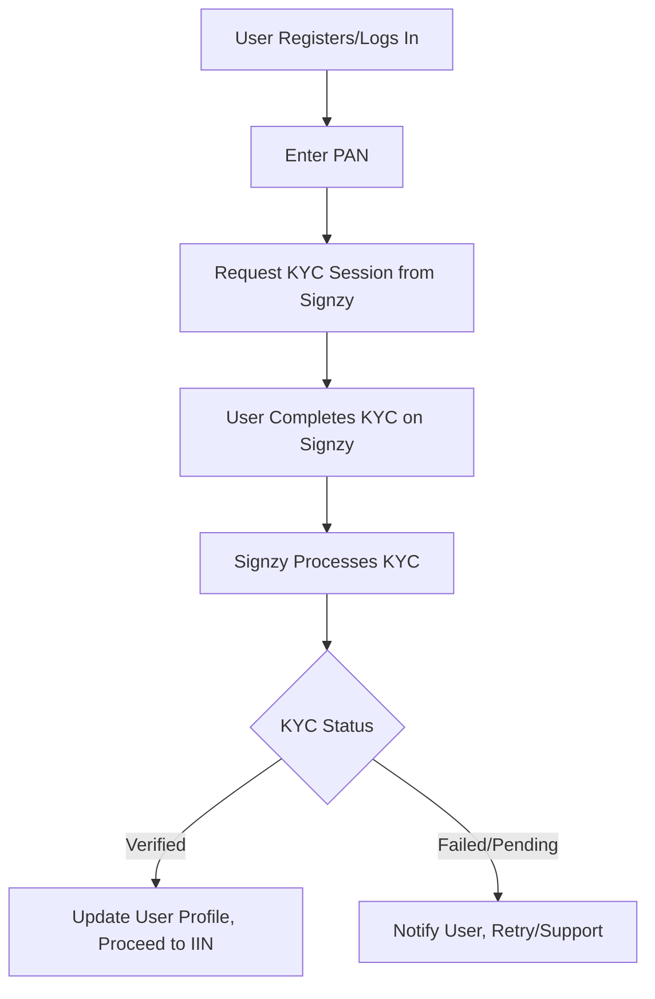
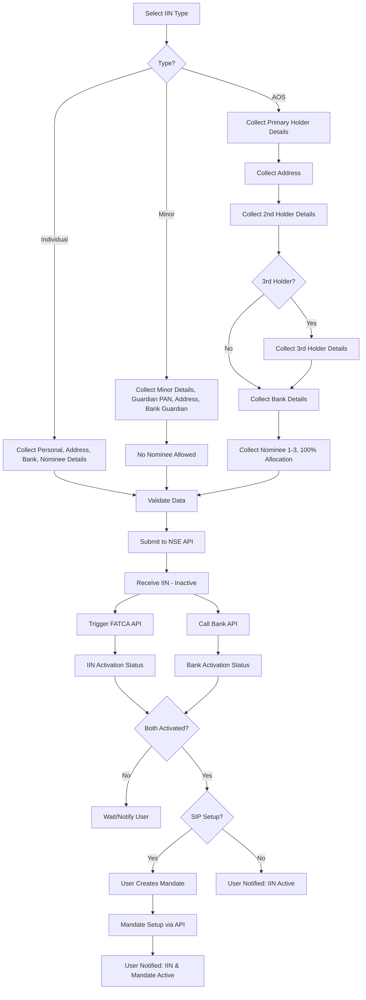

# KYC and IIN System

> **Feature Status**: ✅ Implemented in v2.0 (with known bugs)

This document provides a comprehensive overview of the Know Your Customer (KYC) and Investor Identification Number (IIN) creation systems in Prodigy Pro. Each section details the user journey, technical implementation, integration points, error handling, and compliance considerations.

## Table of Contents
1. [Overview](#overview)
2. [KYC System](#kyc-system)
3. [IIN Creation System](#iin-creation-system)
4. [Technical Architecture](#technical-architecture)
5. [Integration Points](#integration-points)
6. [Error Handling](#error-handling)
7. [Compliance & Security](#compliance--security)
8. [Testing Strategy](#testing-strategy)

---

## Overview

The KYC and IIN systems form the backbone of user onboarding in Prodigy Pro, ensuring regulatory compliance while providing a seamless user experience. These systems work together to:

- Verify user identity (KYC) according to SEBI regulations
- Create investor accounts (IIN) for mutual fund transactions
- Enable various investment scenarios (Individual, Minor, Joint holdings)
- Maintain compliance with regulatory requirements

### Key Features
- **Digital KYC**: Integration with Signzy and DigiLocker
- **Multiple IIN Types**: Individual, Minor, Joint (AOS) holdings
- **Real-time Status Updates**: Polling and webhook-based status tracking
- **Comprehensive Validation**: Data validation and error handling
- **Regulatory Compliance**: SEBI, KRA, NSE, and FATCA compliance

---

## KYC System

### User Flow



### Process Steps

1. **Initial Registration**
   - User registers/logs in with mobile number and OTP
   - System validates user existence in database

2. **PAN Collection**
   - User prompted to enter PAN for KYC initiation
   - Frontend validates PAN format and checksum

3. **KYC Session Initiation**
   - System requests KYC session URL from Signzy API
   - User redirected to Signzy platform (in-app browser/webview)

4. **Document Verification**
   - User completes KYC on Signzy platform:
     - DigiLocker authentication
     - Document upload (Aadhaar, PAN, etc.)
     - Selfie verification
     - Address verification

5. **Status Processing**
   - System polls or receives webhook from Signzy
   - KYC status updated in user profile
   - User notified of verification result

### Technical Implementation

#### Frontend Components
```dart
// Example BLoC structure for KYC
class KycBloc extends Bloc<KycEvent, KycState> {
  final KycRepository kycRepository;

  KycBloc({required this.kycRepository}) : super(KycInitial()) {
    on<InitiateKyc>(_onInitiateKyc);
    on<CheckKycStatus>(_onCheckKycStatus);
  }

  Future<void> _onInitiateKyc(
    InitiateKyc event,
    Emitter<KycState> emit,
  ) async {
    try {
      emit(KycLoading());

      final kycSession = await kycRepository.initiateKyc(event.pan);

      emit(KycSessionCreated(
        sessionUrl: kycSession.url,
        sessionId: kycSession.id,
      ));
    } catch (e) {
      emit(KycError(message: e.toString()));
    }
  }
}
```

#### Backend Integration
- **API Endpoint**: `POST /api/v1/kyc/initiate`
- **Signzy Integration**: Session management and status tracking
- **Webhook Handling**: Real-time status updates
- **Data Storage**: KYC status and metadata in MongoDB

### Integration Points

- **Signzy API**: Primary KYC verification service
- **DigiLocker**: Digital document verification
- **KRA (CAMS)**: Regulatory KYC record keeping
- **Internal APIs**: User profile and status management

---

## IIN Creation System

### IIN Types & Scenarios

#### 1. Single Holding (Individual)
- **Use Case**: Standard adult investor
- **Data Required**: PAN, personal details, address, bank info
- **Nominees**: 1-3 allowed (allocation must total 100%)

#### 2. Single Holding (On-behalf of Minor)
- **Use Case**: Investments for minor children
- **Data Required**: Minor's details, guardian's PAN and details
- **Nominees**: Not allowed
- **Guardian**: Acts as primary holder

#### 3. Joint Holding (Anyone or Survivor/AOS)
- **Use Case**: Joint investment accounts
- **Holders**: 2-3 individuals maximum
- **Data Collection Order**:
  1. Primary holder details and address
  2. Secondary holder details
  3. Tertiary holder details (if applicable)
  4. Bank details (primary holder)
  5. Nominees (1-3, 100% allocation)

### Enhanced IIN Creation Flow



### Data Validation Rules

#### PAN Validation
```dart
// Example validation logic
class PanValidator {
  static String? validatePan(String? pan) {
    if (pan == null || pan.isEmpty) {
      return 'PAN is required';
    }

    // PAN format: AAAPL1234C
    final panRegex = RegExp(r'^[A-Z]{5}[0-9]{4}[A-Z]{1}$');
    if (!panRegex.hasMatch(pan)) {
      return 'Invalid PAN format';
    }

    return null;
  }
}
```

#### Nominee Allocation Validation
```dart
class NomineeValidator {
  static String? validateAllocation(List<Nominee> nominees) {
    if (nominees.isEmpty) return null;

    final totalAllocation = nominees
        .map((n) => n.allocationPercentage)
        .reduce((a, b) => a + b);

    if (totalAllocation != 100.0) {
      return 'Nominee allocation must total 100%';
    }

    return null;
  }
}
```

---

## Technical Architecture

### Data Models

#### KYC Models
```dart
// Domain Entity
class KycStatus {
  final String userId;
  final String pan;
  final KycVerificationStatus status;
  final String? sessionId;
  final DateTime? verifiedAt;
  final String? failureReason;

  const KycStatus({
    required this.userId,
    required this.pan,
    required this.status,
    this.sessionId,
    this.verifiedAt,
    this.failureReason,
  });
}

enum KycVerificationStatus {
  pending,
  inProgress,
  verified,
  failed,
  expired,
}
```

#### IIN Models
```dart
// Domain Entity
class IinCreationRequest {
  final String userId;
  final IinType type;
  final PersonalDetails primaryHolder;
  final List<PersonalDetails>? additionalHolders;
  final AddressDetails address;
  final BankDetails bankDetails;
  final List<NomineeDetails>? nominees;

  const IinCreationRequest({
    required this.userId,
    required this.type,
    required this.primaryHolder,
    this.additionalHolders,
    required this.address,
    required this.bankDetails,
    this.nominees,
  });
}

enum IinType {
  individual,
  minor,
  jointAOS,
}
```

### Repository Pattern Implementation

```dart
// KYC Repository Interface
abstract class KycRepository {
  Future<KycSession> initiateKyc(String pan);
  Future<KycStatus> getKycStatus(String userId);
  Future<void> updateKycStatus(String userId, KycVerificationStatus status);
  Stream<KycStatus> watchKycStatus(String userId);
}

// IIN Repository Interface
abstract class IinRepository {
  Future<IinCreationResult> createIin(IinCreationRequest request);
  Future<IinStatus> getIinStatus(String userId);
  Future<void> activateIin(String iinNumber);
  Future<BankActivationResult> activateBank(String iinNumber, BankDetails bank);
}
```

---

## Integration Points

### External Service Integrations

#### Signzy Integration
```dart
class SignzyService {
  final Dio _dio;

  Future<KycSession> createKycSession({
    required String pan,
    required String mobile,
  }) async {
    final response = await _dio.post('/kyc/session', data: {
      'pan': pan,
      'mobile': mobile,
      'redirect_url': 'prodigypro://kyc/callback',
    });

    return KycSession.fromJson(response.data);
  }

  Future<KycStatus> getKycStatus(String sessionId) async {
    final response = await _dio.get('/kyc/status/$sessionId');
    return KycStatus.fromJson(response.data);
  }
}
```

#### NSE API Integration
```dart
class NseApiService {
  Future<IinCreationResult> createIin(IinCreationRequest request) async {
    try {
      final response = await _dio.post('/iin/create',
        data: request.toNseFormat(),
      );

      return IinCreationResult.fromJson(response.data);
    } on DioException catch (e) {
      throw NseApiException.fromDioError(e);
    }
  }
}
```

### API Endpoints

| Endpoint | Method | Purpose |
|----------|--------|---------|
| `/api/v1/kyc/initiate` | POST | Initiate KYC process |
| `/api/v1/kyc/status/{userId}` | GET | Get KYC status |
| `/api/v1/kyc/webhook` | POST | Signzy webhook handler |
| `/api/v1/iin/create` | POST | Create IIN |
| `/api/v1/iin/status/{userId}` | GET | Get IIN status |
| `/api/v1/iin/activate` | POST | Activate IIN |

---

## Error Handling

### Common Error Scenarios

#### KYC Errors
```dart
class KycException extends AppException {
  const KycException({
    required String message,
    String? code,
    dynamic originalError,
  }) : super(message: message, code: code, originalError: originalError);
}

class KycSessionExpiredException extends KycException {
  const KycSessionExpiredException()
      : super(
          message: 'KYC session has expired. Please start again.',
          code: 'KYC_SESSION_EXPIRED',
        );
}

class KycVerificationFailedException extends KycException {
  final String reason;

  const KycVerificationFailedException({required this.reason})
      : super(
          message: 'KYC verification failed: $reason',
          code: 'KYC_VERIFICATION_FAILED',
        );
}
```

#### IIN Creation Errors
```dart
class IinCreationException extends AppException {
  const IinCreationException({
    required String message,
    String? code,
    dynamic originalError,
  }) : super(message: message, code: code, originalError: originalError);
}

class InvalidIinDataException extends IinCreationException {
  final Map<String, String> fieldErrors;

  const InvalidIinDataException({required this.fieldErrors})
      : super(
          message: 'Invalid IIN data provided',
          code: 'INVALID_IIN_DATA',
        );
}
```

### Error Recovery Strategies

1. **Automatic Retry**: For network-related failures
2. **User Intervention**: For validation errors
3. **Fallback Options**: Alternative KYC providers
4. **Status Polling**: For delayed activations

---

## Compliance & Security

### Regulatory Compliance

#### SEBI Guidelines
- Digital KYC acceptance for mutual fund investments
- Customer identification and verification requirements
- Record keeping and audit trail maintenance

#### KRA Compliance
- Central KYC Records Agency integration
- Standardized KYC data format
- Regular compliance reporting

#### Data Protection
```dart
class DataProtectionService {
  // Mask sensitive data in logs
  static String maskPan(String pan) {
    if (pan.length != 10) return pan;
    return '${pan.substring(0, 3)}*****${pan.substring(8)}';
  }

  // Encrypt sensitive data
  static Future<String> encryptSensitiveData(String data) async {
    // Implementation for data encryption
    return encryptedData;
  }
}
```

### Security Measures

1. **Data Encryption**: All sensitive data encrypted in transit and at rest
2. **Access Control**: Role-based access to KYC/IIN data
3. **Audit Logging**: Comprehensive audit trail for compliance
4. **Secure Communication**: HTTPS for all API communications

---

## Testing Strategy

### Test Scenarios

#### KYC Testing
```dart
group('KYC System Tests', () {
  testWidgets('should initiate KYC with valid PAN', (tester) async {
    // Test implementation
  });

  testWidgets('should handle KYC verification success', (tester) async {
    // Test implementation
  });

  testWidgets('should handle KYC verification failure', (tester) async {
    // Test implementation
  });
});
```

#### IIN Creation Testing
```dart
group('IIN Creation Tests', () {
  test('should validate nominee allocation totals 100%', () {
    // Test implementation
  });

  test('should create individual IIN successfully', () {
    // Test implementation
  });

  test('should handle joint holder data collection', () {
    // Test implementation
  });
});
```

### Integration Testing

1. **Signzy Integration**: Mock Signzy responses for different scenarios
2. **NSE API Testing**: Test IIN creation with various data combinations
3. **End-to-End Flow**: Complete user journey from registration to IIN activation

### Performance Testing

- **Load Testing**: Handle multiple concurrent KYC/IIN requests
- **Response Time**: KYC initiation < 2 seconds, IIN creation < 5 seconds
- **Error Rate**: < 0.1% for successful KYC verifications

---

## Known Issues (v2.0)

### Current Bugs
- [ ] KYC session timeout not properly handled in UI
- [ ] IIN activation status polling sometimes fails
- [ ] Nominee allocation validation bypassed in certain scenarios
- [ ] Error messages not localized

### Planned Improvements
- [ ] Offline KYC data caching
- [ ] Enhanced error recovery mechanisms
- [ ] Real-time status updates via WebSocket
- [ ] Progressive web app support for KYC

---

*This document is maintained as part of the Prodigy Pro v2.0 feature documentation. For technical implementation details, refer to the [Architecture Documentation](../architecture/README.md).*
