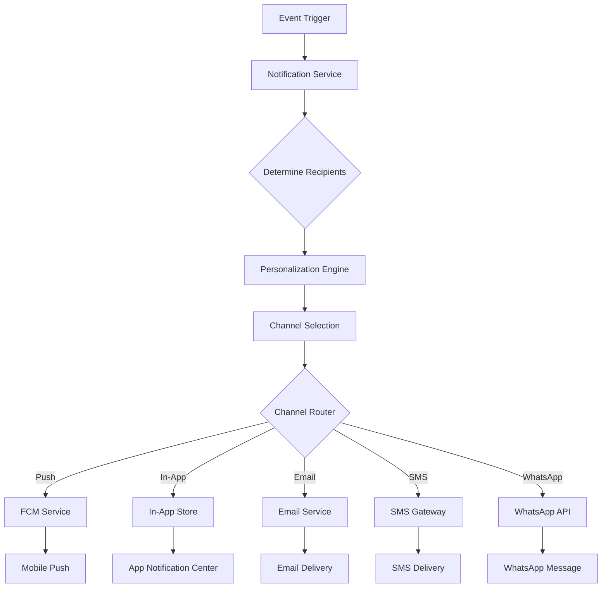

# Notification System

> **Feature Status**: 🚧 In Development (v2.0)

This document provides a comprehensive overview of the notification system in Prodigy Pro, covering multiple delivery channels, real-time messaging, and user engagement strategies.

## Table of Contents
1. [Overview](#overview)
2. [Notification Channels](#notification-channels)
3. [Notification Types & Triggers](#notification-types--triggers)
4. [Technical Architecture](#technical-architecture)
5. [Implementation](#implementation)
6. [User Preferences](#user-preferences)
7. [Security & Compliance](#security--compliance)
8. [Testing Strategy](#testing-strategy)

---

## Overview

The Prodigy Pro notification system ensures users are promptly informed about important events and actions within the platform. Notifications are delivered through multiple channels to maximize reach, engagement, and personalization.

### Key Features
- **Multi-Channel Delivery**: Push, in-app, email, SMS, and WhatsApp notifications
- **Real-time Processing**: Instant notification delivery for critical events
- **Personalization**: Context-aware and user-specific messaging
- **FCM Integration**: Firebase Cloud Messaging for mobile push notifications
- **Compliance Ready**: Audit trails and regulatory compliance support

---

## Notification Channels

### 1. Push Notifications
- **Platform**: Firebase Cloud Messaging (FCM)
- **Target**: Mobile app users (Android/iOS)
- **Use Case**: Immediate alerts for critical events
- **Features**: Rich notifications with actions, deep linking

### 2. In-App Notifications
- **Platform**: Within the mobile and web applications
- **Target**: Active users within the app
- **Use Case**: Real-time status updates and system messages
- **Features**: Toast messages, notification center, badges

### 3. Email Notifications
- **Platform**: SMTP/Email service provider
- **Target**: All registered users
- **Use Case**: Detailed information, statements, confirmations
- **Features**: HTML templates, attachments, tracking

### 4. SMS Notifications
- **Platform**: SMS gateway provider
- **Target**: All users with mobile numbers
- **Use Case**: Critical alerts, OTP, transaction confirmations
- **Features**: Template-based messages, delivery tracking

### 5. WhatsApp Notifications
- **Platform**: WhatsApp Business API
- **Target**: Users who opt-in for WhatsApp communication
- **Use Case**: Rich media notifications, customer support
- **Features**: Media attachments, interactive messages

---

## Notification Types & Triggers

### Authentication & Onboarding
- User registration and welcome messages
- Profile completion reminders
- KYC initiation, completion, failure, or pending status
- IIN creation, activation, or failure notifications

### Transaction Events
- Order placed (purchase, SIP, STP, SWP, redemption, switch)
- Order status updates (processing, completed, failed, rejected)
- NAV allotment and unit allocation
- Transaction success, failure, or reversal notifications

### Investment Management
- SIP due date reminders and installment status
- SWP/STP schedule reminders and execution status
- Portfolio updates (gains/losses, rebalancing suggestions)
- Mandate creation, approval, or failure

### Market & Product Updates
- New fund launches (NFO) and recommendations
- Personalized investment ideas and suggestions
- Tax-saving opportunities and reminders
- Market alerts and investment insights

### Account & Support
- Statement availability (monthly, quarterly, annual)
- Support ticket creation, updates, and resolution
- Security alerts (new device login, password changes)
- System maintenance and feature announcements

### Personalized Engagement
- Birthday, anniversary, and milestone greetings
- Goal achievement notifications
- Personalized nudges and investment reminders
- Educational content and tips

---

## Technical Architecture

### Notification Flow



### Core Components

#### 1. Notification Service
```dart
// Core notification service interface
abstract class NotificationService {
  Future<void> sendNotification(NotificationRequest request);
  Future<void> sendBulkNotifications(List<NotificationRequest> requests);
  Future<NotificationStatus> getDeliveryStatus(String notificationId);
  Stream<NotificationEvent> watchNotificationEvents();
}

// Notification request model
class NotificationRequest {
  final String userId;
  final NotificationTemplate template;
  final Map<String, dynamic> data;
  final List<NotificationChannel> channels;
  final NotificationPriority priority;
  final DateTime? scheduledAt;

  const NotificationRequest({
    required this.userId,
    required this.template,
    required this.data,
    required this.channels,
    this.priority = NotificationPriority.normal,
    this.scheduledAt,
  });
}
```

#### 2. FCM Token Management
```dart
class FcmTokenService {
  final FirebaseMessaging _messaging = FirebaseMessaging.instance;

  Future<String?> getFcmToken() async {
    try {
      final token = await _messaging.getToken();
      return token;
    } catch (e) {
      // Handle token retrieval error
      return null;
    }
  }

  Future<void> updateTokenOnBackend(String token) async {
    await _notificationRepository.updateFcmToken(
      userId: _authService.currentUserId,
      token: token,
    );
  }

  void setupTokenRefreshListener() {
    _messaging.onTokenRefresh.listen((token) {
      updateTokenOnBackend(token);
    });
  }
}
```

#### 3. Template Engine
```dart
class NotificationTemplateEngine {
  static const Map<NotificationTemplate, TemplateConfig> _templates = {
    NotificationTemplate.sipSuccess: TemplateConfig(
      title: 'SIP Investment Successful',
      body: 'Your SIP of ₹{amount} in {fundName} has been processed successfully.',
      channels: [NotificationChannel.push, NotificationChannel.email],
    ),
    NotificationTemplate.kycPending: TemplateConfig(
      title: 'Complete Your KYC',
      body: 'Your KYC verification is pending. Complete it now to start investing.',
      channels: [NotificationChannel.push, NotificationChannel.inApp],
    ),
  };

  static NotificationContent buildContent(
    NotificationTemplate template,
    Map<String, dynamic> data,
  ) {
    final config = _templates[template];
    if (config == null) throw Exception('Template not found');

    return NotificationContent(
      title: _interpolate(config.title, data),
      body: _interpolate(config.body, data),
      metadata: data,
    );
  }
}
```

---

## Implementation

### FCM Integration

#### Android Setup
```xml
<!-- android/app/src/main/AndroidManifest.xml -->
<service
    android:name=".MyFirebaseMessagingService"
    android:exported="false">
    <intent-filter>
        <action android:name="com.google.firebase.MESSAGING_EVENT" />
    </intent-filter>
</service>
```

#### iOS Setup
```swift
// iOS/Runner/AppDelegate.swift
import FirebaseMessaging

@UIApplicationMain
@objc class AppDelegate: FlutterAppDelegate {
  override func application(
    _ application: UIApplication,
    didFinishLaunchingWithOptions launchOptions: [UIApplication.LaunchOptionsKey: Any]?
  ) -> Bool {
    FirebaseApp.configure()
    Messaging.messaging().delegate = self
    return super.application(application, didFinishLaunchingWithOptions: launchOptions)
  }
}
```

#### Flutter Implementation
```dart
class NotificationHandler {
  static final FirebaseMessaging _messaging = FirebaseMessaging.instance;

  static Future<void> initialize() async {
    // Request permission for iOS
    await _messaging.requestPermission(
      alert: true,
      badge: true,
      sound: true,
    );

    // Handle foreground messages
    FirebaseMessaging.onMessage.listen(_handleForegroundMessage);

    // Handle background messages
    FirebaseMessaging.onBackgroundMessage(_handleBackgroundMessage);

    // Handle notification taps
    FirebaseMessaging.onMessageOpenedApp.listen(_handleNotificationTap);
  }

  static void _handleForegroundMessage(RemoteMessage message) {
    // Show in-app notification
    _showInAppNotification(message);
  }

  static void _handleNotificationTap(RemoteMessage message) {
    // Navigate to relevant screen
    _navigateToScreen(message);
  }
}
```

### Repository Pattern Implementation

```dart
// Notification Repository Interface
abstract class NotificationRepository {
  Future<void> updateFcmToken(String userId, String token);
  Future<List<InAppNotification>> getInAppNotifications(String userId);
  Future<void> markNotificationAsRead(String notificationId);
  Future<NotificationPreferences> getUserPreferences(String userId);
  Future<void> updateUserPreferences(String userId, NotificationPreferences preferences);
}

// Implementation
class NotificationRepositoryImpl implements NotificationRepository {
  final ApiClient _apiClient;
  final LocalStorage _localStorage;

  @override
  Future<void> updateFcmToken(String userId, String token) async {
    await _apiClient.post('/api/v1/notifications/fcm-token', data: {
      'userId': userId,
      'token': token,
      'platform': Platform.isAndroid ? 'android' : 'ios',
    });
  }

  @override
  Future<List<InAppNotification>> getInAppNotifications(String userId) async {
    final response = await _apiClient.get('/api/v1/notifications/in-app/$userId');
    return (response.data as List)
        .map((json) => InAppNotification.fromJson(json))
        .toList();
  }
}
```

### BLoC Implementation

```dart
// Notification BLoC
class NotificationBloc extends Bloc<NotificationEvent, NotificationState> {
  final NotificationRepository _repository;
  final NotificationService _service;

  NotificationBloc({
    required NotificationRepository repository,
    required NotificationService service,
  }) : _repository = repository,
       _service = service,
       super(NotificationInitial()) {
    on<LoadInAppNotifications>(_onLoadInAppNotifications);
    on<MarkNotificationAsRead>(_onMarkNotificationAsRead);
    on<UpdateFcmToken>(_onUpdateFcmToken);
  }

  Future<void> _onLoadInAppNotifications(
    LoadInAppNotifications event,
    Emitter<NotificationState> emit,
  ) async {
    try {
      emit(NotificationLoading());

      final notifications = await _repository.getInAppNotifications(event.userId);

      emit(NotificationLoaded(notifications: notifications));
    } catch (e) {
      emit(NotificationError(message: e.toString()));
    }
  }
}
```

---

## User Preferences

### Preference Management

```dart
class NotificationPreferences {
  final bool pushEnabled;
  final bool emailEnabled;
  final bool smsEnabled;
  final bool whatsappEnabled;
  final Map<NotificationCategory, bool> categoryPreferences;
  final DoNotDisturbSchedule? doNotDisturb;

  const NotificationPreferences({
    required this.pushEnabled,
    required this.emailEnabled,
    required this.smsEnabled,
    required this.whatsappEnabled,
    required this.categoryPreferences,
    this.doNotDisturb,
  });
}

enum NotificationCategory {
  transactions,
  portfolio,
  marketing,
  security,
  support,
}

class DoNotDisturbSchedule {
  final TimeOfDay startTime;
  final TimeOfDay endTime;
  final List<int> daysOfWeek; // 1-7, where 1 is Monday

  const DoNotDisturbSchedule({
    required this.startTime,
    required this.endTime,
    required this.daysOfWeek,
  });
}
```

### Preference UI
```dart
class NotificationSettingsScreen extends StatelessWidget {
  @override
  Widget build(BuildContext context) {
    return BlocBuilder<NotificationBloc, NotificationState>(
      builder: (context, state) {
        if (state is NotificationPreferencesLoaded) {
          return _buildPreferencesForm(state.preferences);
        }

        return const CircularProgressIndicator();
      },
    );
  }

  Widget _buildPreferencesForm(NotificationPreferences preferences) {
    return Column(
      children: [
        SwitchListTile(
          title: const Text('Push Notifications'),
          value: preferences.pushEnabled,
          onChanged: (value) => _updatePreference('push', value),
        ),
        SwitchListTile(
          title: const Text('Email Notifications'),
          value: preferences.emailEnabled,
          onChanged: (value) => _updatePreference('email', value),
        ),
        // Additional preference controls...
      ],
    );
  }
}
```

---

## Security & Compliance

### Data Protection
```dart
class NotificationSecurity {
  // Mask sensitive data in notifications
  static String maskSensitiveData(String content) {
    // Mask PAN numbers
    content = content.replaceAllMapped(
      RegExp(r'\b[A-Z]{5}[0-9]{4}[A-Z]{1}\b'),
      (match) => '${match.group(0)!.substring(0, 3)}*****${match.group(0)!.substring(8)}',
    );

    // Mask account numbers
    content = content.replaceAllMapped(
      RegExp(r'\b\d{10,16}\b'),
      (match) => '**** ${match.group(0)!.substring(match.group(0)!.length - 4)}',
    );

    return content;
  }

  // Validate notification content
  static bool validateNotificationContent(String content) {
    // Check for sensitive data exposure
    final sensitivePatterns = [
      RegExp(r'\b[A-Z]{5}[0-9]{4}[A-Z]{1}\b'), // PAN
      RegExp(r'\b\d{16}\b'), // Card numbers
    ];

    return !sensitivePatterns.any((pattern) => pattern.hasMatch(content));
  }
}
```

### Audit Logging
```dart
class NotificationAuditService {
  Future<void> logNotificationEvent({
    required String userId,
    required String notificationId,
    required NotificationEvent event,
    required DateTime timestamp,
  }) async {
    await _auditRepository.createAuditLog(AuditLog(
      entityType: 'notification',
      entityId: notificationId,
      action: event.toString(),
      userId: userId,
      timestamp: timestamp,
      metadata: {
        'notification_type': event.notificationType,
        'delivery_status': event.deliveryStatus,
      },
    ));
  }
}
```

---

## Testing Strategy

### Unit Tests
```dart
group('NotificationService Tests', () {
  test('should send push notification successfully', () async {
    // Arrange
    final mockFcmService = MockFcmService();
    final notificationService = NotificationServiceImpl(fcmService: mockFcmService);

    // Act
    await notificationService.sendNotification(testNotificationRequest);

    // Assert
    verify(mockFcmService.sendToDevice(any, any)).called(1);
  });

  test('should handle FCM token expiration', () async {
    // Test implementation
  });
});
```

### Widget Tests
```dart
group('NotificationSettingsScreen Tests', () {
  testWidgets('should display notification preferences', (tester) async {
    // Arrange
    await tester.pumpWidget(testApp);

    // Act & Assert
    expect(find.text('Push Notifications'), findsOneWidget);
    expect(find.text('Email Notifications'), findsOneWidget);
  });
});
```

### Integration Tests
```dart
group('Notification Integration Tests', () {
  test('should deliver notification end-to-end', () async {
    // Test complete notification flow
  });

  test('should respect user preferences', () async {
    // Test preference filtering
  });
});
```

---

## Known Issues (v2.0)

### Current Limitations
- [ ] WhatsApp integration not yet implemented
- [ ] Rich push notifications (images, actions) not supported
- [ ] Notification analytics and metrics missing
- [ ] Bulk notification throttling needs optimization

### Planned Improvements
- [ ] Machine learning for personalized notification timing
- [ ] A/B testing for notification content
- [ ] Advanced analytics and engagement tracking
- [ ] Multi-language support for notifications

---

*This document is maintained as part of the Prodigy Pro v2.0 feature documentation. For technical implementation details, refer to the [Architecture Documentation](../architecture/README.md).*
