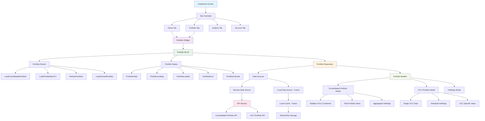

# Portfolio Implementation

## Overview
This document outlines the architecture and implementation strategy for the Portfolio feature in Prodigy Pro v2.0. The portfolio is accessible from both the Home tab and the dedicated Portfolio tab within the main Dashboard, following the clean architecture and BLoC state management patterns.

## Architecture Overview

### High-Level Structure
- **Dashboard**: Main container with 4 tabs (Home, Portfolio, Explore, Account)
- **Portfolio Access**: Available on Home tab and Portfolio tab
- **Data Management**: Repository pattern with BLoC state management
- **Future Caching**: Designed for local data storage implementation

### Component Interaction Diagram



## Component Breakdown

### 1. UI Layer
#### Dashboard Structure
```
Dashboard
├── Tab Controller
│   ├── Home Tab (Portfolio Widget)
│   ├── Portfolio Tab (Portfolio Widget)
│   ├── Explore Tab
│   └── Account Tab
```

#### Portfolio Widget
- Reusable widget displayed on both Home and Portfolio tabs
- Handles UI rendering based on BLoC states
- Supports both consolidated and UCC-specific views

### 2. Business Logic Layer (BLoC)

#### Portfolio BLoC
Manages the state and business logic for portfolio operations.

#### Events
- `LoadConsolidatedPortfolio`: Fetch consolidated portfolio data
- `LoadPortfolioByUCC`: Fetch portfolio for specific UCC
- `RefreshPortfolio`: Refresh current portfolio data
- `LoadCachedPortfolio`: Load data from local cache (future implementation)

#### States
- `PortfolioInitial`: Initial state
- `PortfolioLoading`: Data fetching in progress
- `PortfolioLoaded`: Data successfully loaded
- `PortfolioError`: Error occurred during data fetch
- `PortfolioCached`: Data loaded from local cache (future)

### 3. Data Layer

#### Portfolio Repository
Central data management component that:
- Coordinates between remote and local data sources
- Implements caching logic (future enhancement)
- Provides unified interface for BLoC

#### Data Sources

##### Remote Data Source
- Handles API calls
- Manages network requests
- Error handling and response parsing

##### Local Data Source (Future Implementation)
- SQLite or Hive-based storage
- Caching mechanism
- Offline data access

#### API Services
- **Consolidated Portfolio API**: Fetches aggregated data across multiple UCCs
- **UCC Portfolio API**: Fetches portfolio data for specific UCC

## Portfolio Types

### 1. Consolidated Portfolio
- **Description**: Combined portfolio data from multiple UCCs
- **Features**:
  - Aggregated holdings across all UCCs
  - Total portfolio value calculation
  - Combined performance metrics
  - Multiple UCC management

### 2. Portfolio via UCC (Individual)
- **Description**: Portfolio data for a specific Unique Client Code
- **Features**:
  - Individual holdings for single UCC
  - UCC-specific portfolio value
  - Isolated performance metrics
  - Single client focus

## Data Models

### Consolidated Portfolio Model
```dart
class ConsolidatedPortfolio {
  final String totalValue;
  final List<String> uccList;
  final List<Holdings> aggregatedHoldings;
  final PerformanceMetrics totalPerformance;
  final DateTime lastUpdated;
}
```

### UCC Portfolio Model
```dart
class UCCPortfolio {
  final String ucc;
  final String portfolioValue;
  final List<Holdings> holdings;
  final PerformanceMetrics performance;
  final DateTime lastUpdated;
}
```

### Holdings Model
```dart
class Holdings {
  final String symbol;
  final String quantity;
  final String currentPrice;
  final String marketValue;
  final String pnl;
  // Additional holding details
}
```

## Implementation Strategy

### Phase 1: Core Implementation
1. Set up basic repository structure
2. Implement remote data source
3. Create BLoC with essential events/states
4. Build portfolio widget with loading states
5. Integrate API services
6. Add error handling

### Phase 2: Enhanced Features
1. Implement local caching mechanism
2. Add offline support
3. Optimize data refresh strategies
4. Implement pull-to-refresh
5. Add data synchronization

### Phase 3: Performance Optimization
1. Implement smart caching policies
2. Add background data refresh
3. Optimize memory usage
4. Implement data compression

## Future Considerations

### Local Caching Strategy
- **Storage Options**: SQLite for complex queries, Hive for simple key-value storage
- **Cache Invalidation**: Time-based and event-driven invalidation
- **Offline Support**: Graceful degradation when network unavailable
- **Data Sync**: Conflict resolution and merge strategies

### Performance Optimization
- **Lazy Loading**: Load portfolio data on demand
- **Pagination**: For large holdings lists
- **Background Refresh**: Update data without blocking UI
- **Memory Management**: Efficient data structure usage

## File Structure

```
lib/
└── presentation/
    └── portfolio_screen/
        ├── portfolio_screen.dart         # Main portfolio screen UI and logic
        └── models/
            └── portfolio_model.dart      # Portfolio data models (current scope)
```

> **Note:**
> - All BLoC/state management and UI logic are currently implemented within `portfolio_screen.dart`.
> - If/when the logic is refactored into separate BLoC, event, or state files, or reusable widgets, update this section accordingly.
> - Shared or legacy models may exist in `lib/models/portfolio.dart` but are not part of the new v2.0 feature module.

## Future Scope

- **Local Caching:** Planned for future releases (e.g., Hive/SQLite for offline support).
- **Modularization:** Potential refactor to extract BLoC, events, states, and widgets into their own files/directories for maintainability.
- **Performance:** Background refresh, smart caching, and memory optimization.

## Key Benefits

1. **Separation of Concerns**: Clear separation between UI, business logic, and data
2. **Testability**: Each layer can be tested independently
3. **Scalability**: Easy to add new features and portfolio types
4. **Maintainability**: Modular structure for easy updates
5. **Performance**: Designed for efficient data handling and caching
6. **Flexibility**: Supports multiple portfolio types and viewing contexts

## Planned Directory Refactor

> **Note:**
> The following directory structure will be implemented soon (planned for tomorrow). This will modularize the portfolio feature for better maintainability and scalability.

### New Portfolio Feature Directory Structure

```
lib/
└── presentation/
    └── portfolio_screen/
        ├── bloc/
        │   ├── portfolio_bloc.dart
        │   ├── portfolio_event.dart
        │   └── portfolio_state.dart
        ├── widgets/
        │   ├── portfolio_summary_widget.dart
        │   ├── holdings_list_widget.dart
        │   └── ... (other reusable UI components)
        ├── models/
        │   └── portfolio_model.dart
        ├── portfolio_screen.dart
        └── utils/
            └── portfolio_utils.dart
```

- BLoC logic will be moved out of `portfolio_screen.dart` into the `bloc/` directory.
- Reusable widgets will be placed in the `widgets/` directory.
- Models will remain in `models/`.
- Utility functions (if any) will go in `utils/`.

---

## Project-wide Directory Refactor (TODO)

> **Planned:**
> The entire project will eventually migrate to a clean architecture directory structure, with clear separation of `features/`, `data/`, `domain/`, and `presentation/` layers. This is a future task and will be documented and tracked separately.

Example (future):
```
lib/
└── features/
    └── portfolio/
        ├── data/
        ├── domain/
        └── presentation/
```

