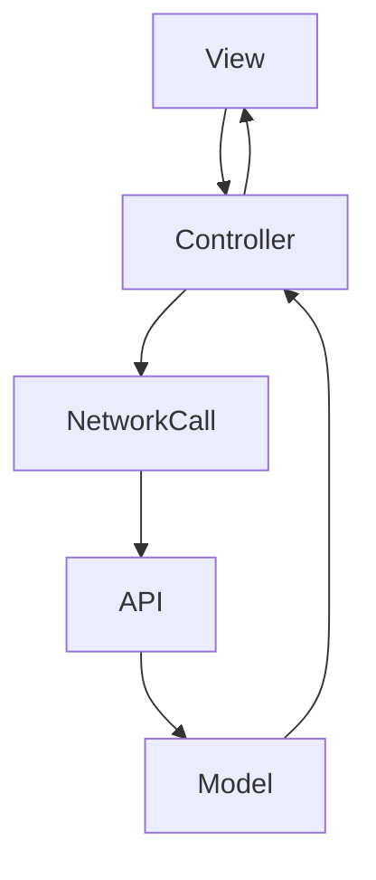
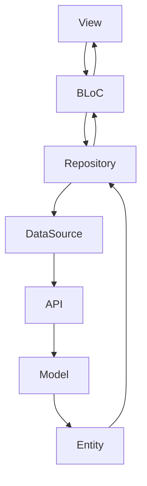

# Prodigy Pro v1.0 to v2.0 Migration Guide

## Table of Contents
1. [Overview](#overview)
2. [Breaking Changes](#breaking-changes)
3. [Architecture Migration](#architecture-migration)
4. [State Management Migration](#state-management-migration)
5. [UI Layer Migration](#ui-layer-migration)
6. [Data Layer Migration](#data-layer-migration)
7. [Feature-Specific Migration](#feature-specific-migration)
8. [Testing Migration](#testing-migration)


---

## Overview

Prodigy Pro v2.0 represents a complete architectural overhaul with new UI designs, improved state management, and better code organization. This migration guide provides a comprehensive roadmap for transitioning from the existing v1.0 codebase to the new v2.0 architecture.

### Key Changes in v2.0
- **Complete UI Redesign**: New design system and user interface
- **Architecture Overhaul**: Migration from GetX to BLoC pattern
- **Repository Pattern**: Implementation of clean architecture data layer
- **Feature-Based Organization**: Restructured codebase with feature-based modules
- **Enhanced Testing**: Comprehensive testing strategy implementation
- **Improved Performance**: Optimized widgets and state management

### Migration Goals
1. **Zero Downtime**: Gradual migration without service interruption
2. **Feature Parity**: Maintain all existing functionality
3. **Performance Improvement**: Enhanced app performance and user experience
4. **Code Quality**: Better maintainability and testability
5. **Developer Experience**: Improved development workflow

---

## Breaking Changes

### 1. State Management Changes

#### GetX Removal
```dart
// v1.0 - GetX Controller
class AuthController extends GetxController {
  final RxString phoneNumber = ''.obs;
  final RxBool isLoading = false.obs;

  void updatePhoneNumber(String value) {
    phoneNumber.value = value;
  }
}

// v2.0 - BLoC
class AuthBloc extends Bloc<AuthEvent, AuthState> {
  AuthBloc() : super(AuthInitial()) {
    on<PhoneNumberChanged>(_onPhoneNumberChanged);
  }

  void _onPhoneNumberChanged(
    PhoneNumberChanged event,
    Emitter<AuthState> emit,
  ) {
    emit(PhoneInputValid(phoneNumber: event.phoneNumber));
  }
}
```

#### UI State Management
```dart
// v1.0 - Obx Widgets
Obx(() => Text(controller.phoneNumber.value))

// v2.0 - BlocBuilder
BlocBuilder<AuthBloc, AuthState>(
  builder: (context, state) {
    if (state is PhoneInputValid) {
      return Text(state.phoneNumber);
    }
    return SizedBox.shrink();
  },
)
```

### 2. Navigation Changes

#### Route Management
```dart
// v1.0 - GetX Navigation
Get.toNamed('/dashboard');
Get.offAllNamed('/login');

// v2.0 - Standard Navigator
Navigator.pushNamed(context, '/dashboard');
Navigator.pushNamedAndRemoveUntil(context, '/login', (route) => false);
```

### 3. Dependency Injection Changes

#### Service Location
```dart
// v1.0 - GetX Dependency Injection
Get.put<UserController>(UserController());
final controller = Get.find<UserController>();

// v2.0 - get_it Service Locator
sl.registerLazySingleton<AuthRepository>(() => AuthRepositoryImpl());
final repository = sl<AuthRepository>();
```

### 4. Data Access Changes

#### API Call Pattern
```dart
// v1.0 - Direct API Calls in Controllers
class UserController extends GetxController {
  Future<void> fetchUser() async {
    final response = await NetworkCall().makePostRequest(
      endPoint: EndPoints.getUser,
      bodyParams: {'user_id': userId},
    );
  }
}

// v2.0 - Repository Pattern
class UserBloc extends Bloc<UserEvent, UserState> {
  final UserRepository _userRepository;

  Future<void> _onFetchUser(
    FetchUser event,
    Emitter<UserState> emit,
  ) async {
    final user = await _userRepository.getUser(event.userId);
    emit(UserLoaded(user: user));
  }
}
```

---

## Architecture Migration

### 1. Folder Structure Changes

#### v1.0 Structure
```
lib/
├── controllers/
├── models/
├── view/
├── api/
├── core/
├── routes/
└── main.dart
```

#### v2.0 Structure
```
lib/
├── presentation/           # UI Layer (BLoC + Screens)
│   ├── feature_name/
│   │   ├── view/
│   │   ├── bloc/
│   │   └── widgets/
├── data/                  # Data Layer
│   ├── repositories/
│   ├── datasources/
│   └── models/
├── domain/                # Business Logic
│   ├── entities/
│   ├── repositories/
│   └── usecases/
├── core/                  # Shared Components
├── injection/             # Dependency Injection
└── main.dart
```

### 2. Layer Separation

#### Presentation Layer Migration
```dart
// v1.0 - Mixed concerns in view
class DashboardScreen extends StatelessWidget {
  final DashboardController controller = Get.find();

  @override
  Widget build(BuildContext context) {
    return Scaffold(
      body: Obx(() => controller.isLoading.value
        ? CircularProgressIndicator()
        : _buildDashboard(),
      ),
    );
  }
}

// v2.0 - Clean separation with BLoC
class DashboardScreen extends StatelessWidget {
  @override
  Widget build(BuildContext context) {
    return BlocProvider(
      create: (context) => DashboardBloc(
        portfolioRepository: context.read<PortfolioRepository>(),
      )..add(LoadDashboard()),
      child: BlocBuilder<DashboardBloc, DashboardState>(
        builder: (context, state) {
          if (state is DashboardLoading) {
            return Center(child: CircularProgressIndicator());
          }
          if (state is DashboardLoaded) {
            return _buildDashboard(state.data);
          }
          return SizedBox.shrink();
        },
      ),
    );
  }
}
```

### 3. Data Flow Changes

#### v1.0 Data Flow


#### v2.0 Data Flow


---

## State Management Migration

### 1. GetX to BLoC Migration

#### Controller to BLoC Conversion

```dart
// Step 1: Identify GetX Controller
class CalculatorController extends GetxController {
  final RxDouble monthlyAmount = 0.0.obs;
  final RxInt period = 0.obs;
  final RxDouble rateOfReturn = 12.0.obs;
  final Rx<CalculatorResult?> result = Rx<CalculatorResult?>(null);
  final RxBool isLoading = false.obs;

  void updateMonthlyAmount(double amount) {
    monthlyAmount.value = amount;
    _calculate();
  }

  void updatePeriod(int years) {
    period.value = years;
    _calculate();
  }

  void _calculate() {
    isLoading.value = true;
    // Calculation logic
    isLoading.value = false;
  }
}

// Step 2: Create BLoC Events
abstract class CalculatorEvent extends Equatable {
  const CalculatorEvent();

  @override
  List<Object?> get props => [];
}

class UpdateMonthlyAmount extends CalculatorEvent {
  final double amount;

  const UpdateMonthlyAmount({required this.amount});

  @override
  List<Object?> get props => [amount];
}

class UpdatePeriod extends CalculatorEvent {
  final int period;

  const UpdatePeriod({required this.period});

  @override
  List<Object?> get props => [period];
}

class CalculateResult extends CalculatorEvent {}

// Step 3: Create BLoC States
abstract class CalculatorState extends Equatable {
  const CalculatorState();

  @override
  List<Object?> get props => [];
}

class CalculatorInitial extends CalculatorState {}

class CalculatorInputUpdated extends CalculatorState {
  final double monthlyAmount;
  final int period;
  final double rateOfReturn;

  const CalculatorInputUpdated({
    required this.monthlyAmount,
    required this.period,
    required this.rateOfReturn,
  });

  @override
  List<Object?> get props => [monthlyAmount, period, rateOfReturn];
}

class CalculatorLoading extends CalculatorState {}

class CalculatorResultLoaded extends CalculatorState {
  final CalculatorResult result;

  const CalculatorResultLoaded({required this.result});

  @override
  List<Object?> get props => [result];
}

// Step 4: Implement BLoC
class CalculatorBloc extends Bloc<CalculatorEvent, CalculatorState> {
  final CalculatorRepository _repository;

  double _monthlyAmount = 0.0;
  int _period = 0;
  double _rateOfReturn = 12.0;

  CalculatorBloc(this._repository) : super(CalculatorInitial()) {
    on<UpdateMonthlyAmount>(_onUpdateMonthlyAmount);
    on<UpdatePeriod>(_onUpdatePeriod);
    on<CalculateResult>(_onCalculateResult);
  }

  void _onUpdateMonthlyAmount(
    UpdateMonthlyAmount event,
    Emitter<CalculatorState> emit,
  ) {
    _monthlyAmount = event.amount;
    emit(CalculatorInputUpdated(
      monthlyAmount: _monthlyAmount,
      period: _period,
      rateOfReturn: _rateOfReturn,
    ));
    add(CalculateResult());
  }

  void _onUpdatePeriod(
    UpdatePeriod event,
    Emitter<CalculatorState> emit,
  ) {
    _period = event.period;
    emit(CalculatorInputUpdated(
      monthlyAmount: _monthlyAmount,
      period: _period,
      rateOfReturn: _rateOfReturn,
    ));
    add(CalculateResult());
  }

  Future<void> _onCalculateResult(
    CalculateResult event,
    Emitter<CalculatorState> emit,
  ) async {
    emit(CalculatorLoading());

    try {
      final result = await _repository.calculateSIP(
        monthlyAmount: _monthlyAmount,
        period: _period,
        rateOfReturn: _rateOfReturn,
      );

      emit(CalculatorResultLoaded(result: result));
    } catch (error) {
      emit(CalculatorError(message: error.toString()));
    }
  }
}
```

### 2. UI Migration

#### Widget Migration Pattern

```dart
// v1.0 - GetX Widget
class CalculatorScreen extends StatelessWidget {
  final CalculatorController controller = Get.put(CalculatorController());

  @override
  Widget build(BuildContext context) {
    return Scaffold(
      appBar: AppBar(title: Text('SIP Calculator')),
      body: Column(
        children: [
          // Monthly Amount Input
          TextField(
            onChanged: (value) {
              controller.updateMonthlyAmount(double.tryParse(value) ?? 0);
            },
            decoration: InputDecoration(labelText: 'Monthly Amount'),
          ),

          // Period Input
          TextField(
            onChanged: (value) {
              controller.updatePeriod(int.tryParse(value) ?? 0);
            },
            decoration: InputDecoration(labelText: 'Period (Years)'),
          ),

          // Result Display
          Obx(() => controller.isLoading.value
            ? CircularProgressIndicator()
            : controller.result.value != null
              ? Text('Future Value: ${controller.result.value!.futureValue}')
              : Text('Enter values to calculate'),
          ),
        ],
      ),
    );
  }
}

// v2.0 - BLoC Widget
class CalculatorScreen extends StatelessWidget {
  @override
  Widget build(BuildContext context) {
    return BlocProvider(
      create: (context) => CalculatorBloc(
        context.read<CalculatorRepository>(),
      ),
      child: Scaffold(
        appBar: AppBar(title: Text('SIP Calculator')),
        body: Column(
          children: [
            // Monthly Amount Input
            BlocBuilder<CalculatorBloc, CalculatorState>(
              builder: (context, state) {
                return TextField(
                  onChanged: (value) {
                    context.read<CalculatorBloc>().add(
                      UpdateMonthlyAmount(
                        amount: double.tryParse(value) ?? 0,
                      ),
                    );
                  },
                  decoration: InputDecoration(labelText: 'Monthly Amount'),
                );
              },
            ),

            // Period Input
            TextField(
              onChanged: (value) {
                context.read<CalculatorBloc>().add(
                  UpdatePeriod(period: int.tryParse(value) ?? 0),
                );
              },
              decoration: InputDecoration(labelText: 'Period (Years)'),
            ),

            // Result Display
            BlocBuilder<CalculatorBloc, CalculatorState>(
              builder: (context, state) {
                if (state is CalculatorLoading) {
                  return CircularProgressIndicator();
                }
                if (state is CalculatorResultLoaded) {
                  return Text('Future Value: ${state.result.futureValue}');
                }
                return Text('Enter values to calculate');
              },
            ),
          ],
        ),
      ),
    );
  }
}
```

---

## UI Layer Migration

### 1. Design System Implementation

#### Theme Migration
```dart
// v1.0 - Basic theme setup
class AppTheme {
  static ThemeData lightTheme = ThemeData(
    primarySwatch: Colors.blue,
    // Basic theme configuration
  );
}

// v2.0 - Comprehensive design system
class AppTheme {
  static ThemeData lightTheme = ThemeData(
    colorScheme: ColorScheme.fromSeed(
      seedColor: AppColors.primary,
      brightness: Brightness.light,
    ),
    textTheme: AppTextStyles.textTheme,
    elevatedButtonTheme: ElevatedButtonThemeData(
      style: AppButtonStyles.primaryButton,
    ),
    inputDecorationTheme: AppInputStyles.defaultInputDecoration,
    cardTheme: CardTheme(
      elevation: AppSpacing.cardElevation,
      shape: RoundedRectangleBorder(
        borderRadius: BorderRadius.circular(AppSpacing.radiusMedium),
      ),
    ),
  );
}
```

#### Component Standardization
```dart
// v1.0 - Custom widgets without standards
class CustomButton extends StatelessWidget {
  final String text;
  final VoidCallback? onPressed;

  @override
  Widget build(BuildContext context) {
    return ElevatedButton(
      onPressed: onPressed,
      child: Text(text),
    );
  }
}

// v2.0 - Standardized design system components
class AppButton extends StatelessWidget {
  final String text;
  final VoidCallback? onPressed;
  final AppButtonVariant variant;
  final AppButtonSize size;

  const AppButton({
    Key? key,
    required this.text,
    this.onPressed,
    this.variant = AppButtonVariant.primary,
    this.size = AppButtonSize.medium,
  }) : super(key: key);

  @override
  Widget build(BuildContext context) {
    return ElevatedButton(
      onPressed: onPressed,
      style: _getButtonStyle(variant, size),
      child: Text(
        text,
        style: _getTextStyle(variant, size),
      ),
    );
  }
}
```

### 2. Screen Structure Migration

#### Presentation Layer Organization
```dart
// v2.0 - Feature-based screen organization
lib/presentation/
├── auth_phone_input_screen/
│   ├── auth_phone_input_screen.dart
│   ├── bloc/
│   │   ├── auth_phone_input_bloc.dart
│   │   ├── auth_phone_input_event.dart
│   │   └── auth_phone_input_state.dart
│   └── widgets/
│       ├── phone_input_field.dart
│       └── otp_timer_widget.dart
├── financial_calculators/
│   ├── sip_calculator/
│   │   ├── view/
│   │   │   └── sip_calculator_screen.dart
│   │   ├── bloc/
│   │   │   ├── sip_calculator_bloc.dart
│   │   │   ├── sip_calculator_event.dart
│   │   │   └── sip_calculator_state.dart
│   │   └── widgets/
│   │       ├── amount_input_widget.dart
│   │       └── result_chart_widget.dart
```

---

## Data Layer Migration

### 1. Repository Pattern Implementation

#### Current API Call Pattern (v1.0)
```dart
// controllers/portfolio.dart
class PortfolioController extends GetxController {
  Future<void> fetchPortfolioSnapshot({
    required PortfolioSnapshotRequestModel requestParams,
    required Function(SnapshotData) onSuccess,
  }) async {
    var request = NetworkCall().makePostRequest(
      endPoint: EndPoints.getPortfolioSnapshot,
      bodyParams: requestParams.toJson(),
    );

    request.then((response) {
      if (response.statusCode == 200) {
        var responseJson = json.decode(response.body);
        if (responseJson["status"] == "success") {
          SnapshotData snapshotData = SnapshotData.fromJson(responseJson["data"]);
          onSuccess(snapshotData);
        }
      }
    });
  }
}
```

#### New Repository Pattern (v2.0)
```dart
// 1. Domain Layer - Repository Interface
abstract class PortfolioRepository {
  Future<PortfolioSnapshot> getPortfolioSnapshot(PortfolioSnapshotRequest request);
}

// 2. Data Layer - Remote Data Source
abstract class PortfolioRemoteDataSource {
  Future<PortfolioSnapshotModel> getPortfolioSnapshot(PortfolioSnapshotRequestModel request);
}

class PortfolioRemoteDataSourceImpl implements PortfolioRemoteDataSource {
  final Dio _dio;

  @override
  Future<PortfolioSnapshotModel> getPortfolioSnapshot(
    PortfolioSnapshotRequestModel request,
  ) async {
    final response = await _dio.post(
      EndPoints.getPortfolioSnapshot,
      data: request.toJson(),
    );

    if (response.statusCode == 200) {
      final responseJson = response.data;
      if (responseJson["status"] == "success") {
        return PortfolioSnapshotModel.fromJson(responseJson["data"]);
      }
    }

    throw ServerException(
      message: 'Failed to fetch portfolio snapshot',
      statusCode: response.statusCode ?? 500,
    );
  }
}

// 3. Data Layer - Repository Implementation
class PortfolioRepositoryImpl implements PortfolioRepository {
  final PortfolioRemoteDataSource _remoteDataSource;
  final PortfolioLocalDataSource _localDataSource;
  final NetworkInfo _networkInfo;

  @override
  Future<PortfolioSnapshot> getPortfolioSnapshot(
    PortfolioSnapshotRequest request,
  ) async {
    try {
      if (await _networkInfo.isConnected) {
        final remoteData = await _remoteDataSource.getPortfolioSnapshot(
          PortfolioSnapshotRequestModel.fromDomain(request),
        );

        // Cache locally
        await _localDataSource.cachePortfolioSnapshot(remoteData);

        return remoteData.toDomain();
      } else {
        // Fallback to cached data
        final cachedData = await _localDataSource.getCachedPortfolioSnapshot(request);
        if (cachedData != null) {
          return cachedData.toDomain();
        }

        throw NetworkFailure(message: 'No internet connection and no cached data');
      }
    } on ServerException catch (e) {
      throw ServerFailure(message: e.message);
    }
  }
}

// 4. Presentation Layer - BLoC
class PortfolioBloc extends Bloc<PortfolioEvent, PortfolioState> {
  final PortfolioRepository _portfolioRepository;

  Future<void> _onLoadPortfolioSnapshot(
    LoadPortfolioSnapshot event,
    Emitter<PortfolioState> emit,
  ) async {
    try {
      emit(PortfolioLoading());

      final portfolio = await _portfolioRepository.getPortfolioSnapshot(event.request);

      emit(PortfolioSnapshotLoaded(portfolio: portfolio));
    } catch (error) {
      emit(PortfolioError(message: error.toString()));
    }
  }
}
```

### 2. Model Migration

#### Data Model Restructuring
```dart
// v1.0 - Single model for API and UI
class SnapshotData {
  String? totalPurchase;
  String? totalMarketValue;
  String? totalDaysChange;
  // ... other fields

  SnapshotData.fromJson(Map<String, dynamic> json) {
    totalPurchase = json['total_purchase'];
    totalMarketValue = json['total_market_value'];
    // ... parsing logic
  }
}

// v2.0 - Separate models for different layers

// Data Layer Model (API Response)
class PortfolioSnapshotModel {
  final String totalPurchase;
  final String totalMarketValue;
  final String totalDaysChange;

  const PortfolioSnapshotModel({
    required this.totalPurchase,
    required this.totalMarketValue,
    required this.totalDaysChange,
  });

  factory PortfolioSnapshotModel.fromJson(Map<String, dynamic> json) {
    return PortfolioSnapshotModel(
      totalPurchase: json['total_purchase'] ?? '0',
      totalMarketValue: json['total_market_value'] ?? '0',
      totalDaysChange: json['total_days_change'] ?? '0',
    );
  }

  // Convert to domain entity
  PortfolioSnapshot toDomain() {
    return PortfolioSnapshot(
      totalPurchase: double.tryParse(totalPurchase) ?? 0.0,
      totalMarketValue: double.tryParse(totalMarketValue) ?? 0.0,
      totalDaysChange: double.tryParse(totalDaysChange) ?? 0.0,
    );
  }
}

// Domain Layer Entity
class PortfolioSnapshot {
  final double totalPurchase;
  final double totalMarketValue;
  final double totalDaysChange;

  const PortfolioSnapshot({
    required this.totalPurchase,
    required this.totalMarketValue,
    required this.totalDaysChange,
  });

  double get gainLoss => totalMarketValue - totalPurchase;
  double get gainLossPercentage =>
      totalPurchase > 0 ? (gainLoss / totalPurchase) * 100 : 0;
}
```

---

## Feature-Specific Migration

### 1. Authentication Flow Migration

#### v1.0 Implementation
```dart
// Current implementation scattered across multiple controllers
class AuthController extends GetxController {
  final RxString phoneNumber = ''.obs;
  final RxBool isOtpSent = false.obs;
  final RxBool isLoading = false.obs;
}

class UserController extends GetxController {
  final Rx<User?> user = Rx<User?>(null);
  final RxBool isLoggedIn = false.obs;
}
```

#### v2.0 Implementation
```dart
// Unified authentication flow with BLoC
class AuthFlowBloc extends Bloc<AuthFlowEvent, AuthFlowState> {
  final AuthRepository _authRepository;

  AuthFlowBloc(this._authRepository) : super(AuthFlowInitial()) {
    on<StartAuthFlow>(_onStartAuthFlow);
    on<SubmitPhoneNumber>(_onSubmitPhoneNumber);
    on<VerifyOTP>(_onVerifyOTP);
    on<EnableBiometric>(_onEnableBiometric);
  }

  // Centralized authentication logic
}
```

### 2. Calculator Migration

#### Current SIP Calculator (v1.0)
The current SIP calculator has the following structure:
- `presentation/financial_calculators/sip_calculator/`
- Uses BLoC pattern (already migrated)
- Has some bugs that need fixing

#### Migration Tasks for Calculators
1. **Fix Existing Bugs**: Address known issues in current implementation
2. **Repository Integration**: Add repository pattern for calculation logic
3. **Enhanced Validation**: Improve input validation and error handling
4. **Performance Optimization**: Optimize calculation performance
5. **UI Consistency**: Ensure UI follows new design system

### 3. Goal Planning Migration

#### Current Implementation Analysis
```dart
// Current goal planning structure needs:
// 1. BLoC implementation
// 2. Repository pattern
// 3. Better state management
// 4. Enhanced UI components
```

#### Migration Plan
1. Create goal planning repository
2. Implement BLoC for goal management
3. Add comprehensive testing
4. Update UI to new design system

---

## Testing Migration

### 1. Testing Strategy Update

#### v1.0 Testing Gaps
- Limited unit tests
- No widget testing
- No integration testing
- Manual testing dependent

#### v2.0 Testing Strategy
```dart
// 1. Unit Tests for BLoCs
class AuthBlocTest {
  group('AuthBloc', () {
    blocTest<AuthBloc, AuthState>(
      'emits [AuthLoading, AuthSuccess] when login succeeds',
      build: () => AuthBloc(mockRepository),
      act: (bloc) => bloc.add(LoginRequested(phoneNumber: '+1234567890')),
      expect: () => [AuthLoading(), AuthSuccess(user: mockUser)],
    );
  });
}

// 2. Repository Tests
class AuthRepositoryTest {
  test('should return user when login succeeds', () async {
    // Arrange
    when(mockRemoteDataSource.login(any())).thenAnswer((_) async => mockUserModel);

    // Act
    final result = await repository.login('+1234567890');

    // Assert
    expect(result, equals(mockUser));
  });
}

// 3. Widget Tests
class AuthScreenTest {
  testWidgets('should display loading indicator when loading', (tester) async {
    when(() => mockAuthBloc.state).thenReturn(AuthLoading());

    await tester.pumpWidget(createWidgetUnderTest());

    expect(find.byType(CircularProgressIndicator), findsOneWidget);
  });
}
```

### 2. Test Coverage Goals
- **Unit Tests**: 80% coverage for BLoCs and repositories
- **Widget Tests**: 70% coverage for custom widgets
- **Integration Tests**: Critical user flows
- **Golden Tests**: UI regression prevention

---

*This migration guide serves as the comprehensive roadmap for transitioning Prodigy Pro from v1.0 to v2.0. Regular updates and adjustments may be needed based on progress and discoveries during implementation.*
