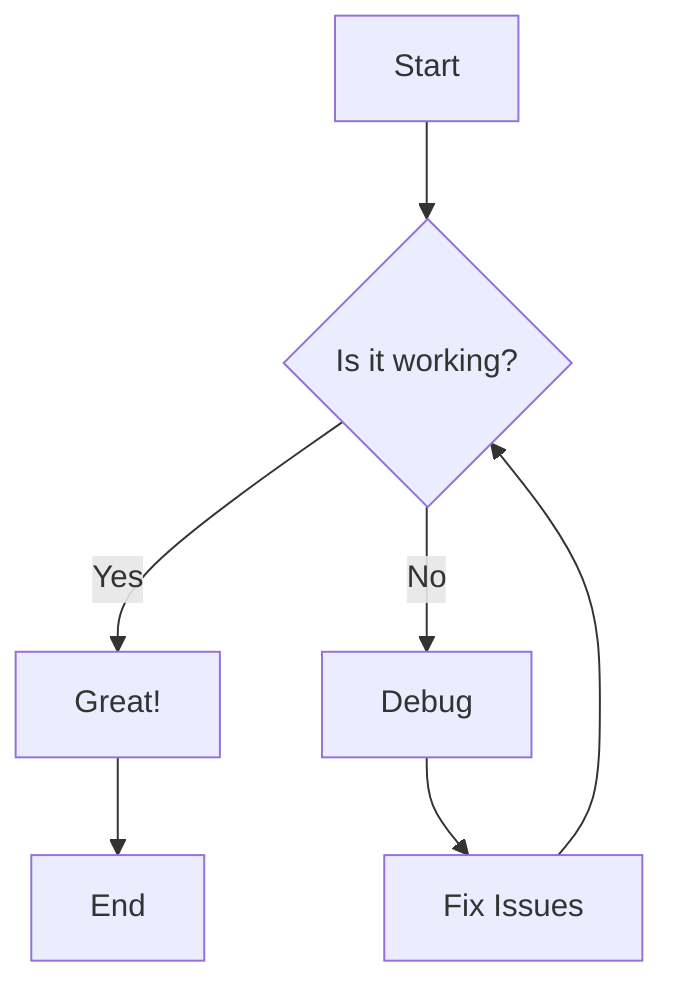
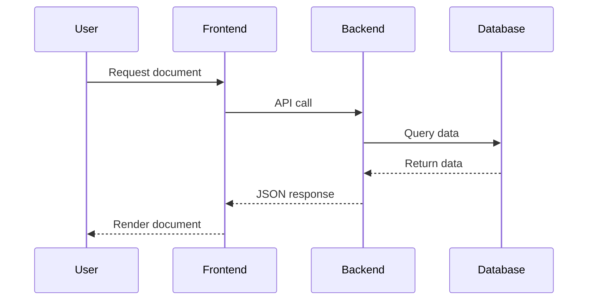
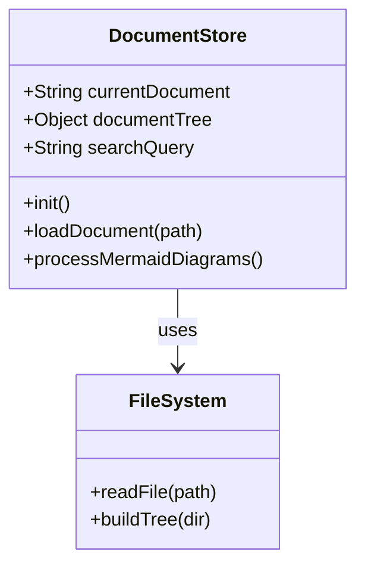
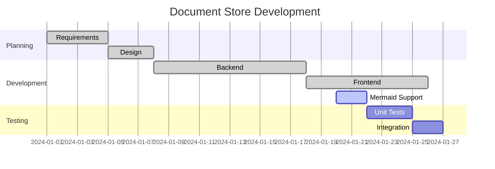
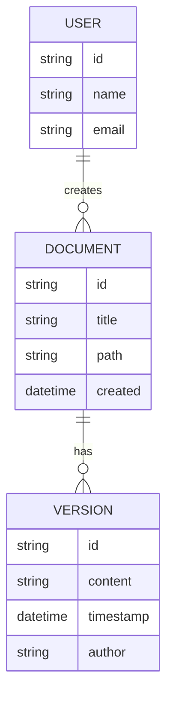
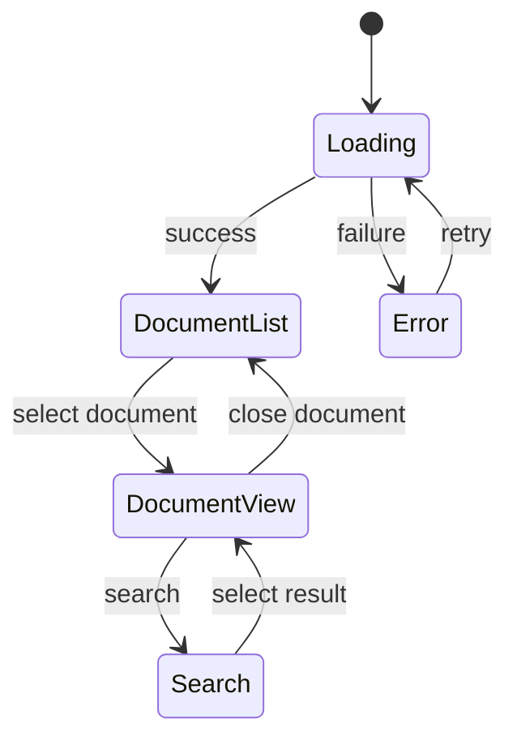
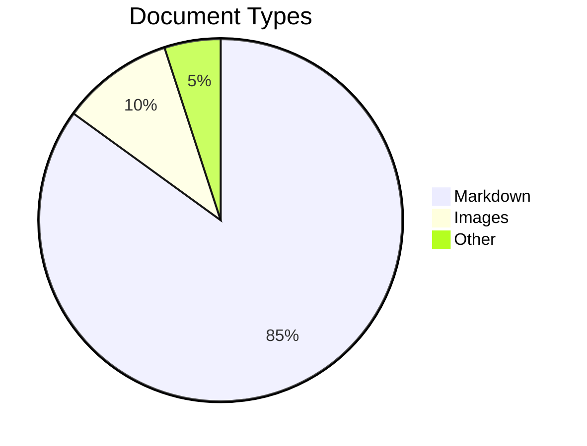
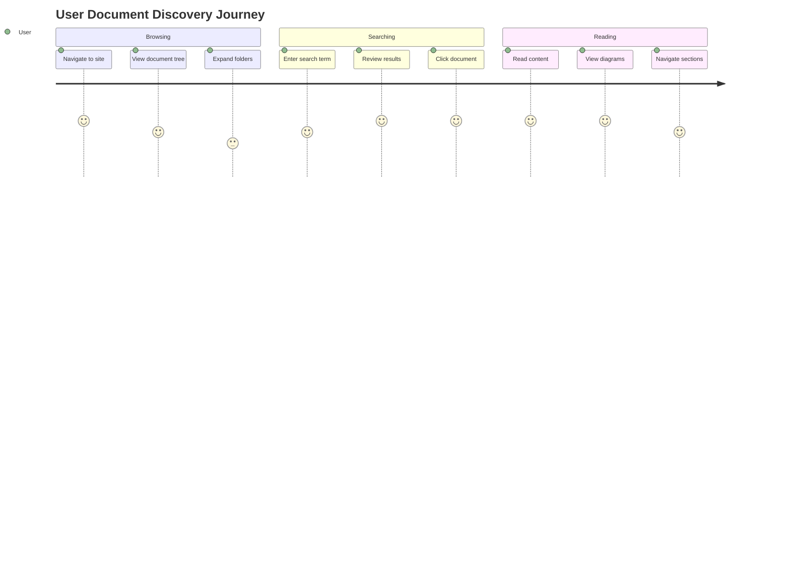

# Mermaid Diagram Examples

This document showcases various types of Mermaid diagrams supported by the Document Store.

## Flowchart



## Sequence Diagram



## Class Diagram



## Gantt Chart



## Git Graph

```mermaid
gitgraph
    commit id: "Initial commit"
    branch feature/mermaid
    checkout feature/mermaid
    commit id: "Add Mermaid.js"
    commit id: "Process diagrams"
    checkout main
    commit id: "Bug fixes"
    merge feature/mermaid
    commit id: "Release v1.1"
```

## Entity Relationship Diagram



## State Diagram



## Pie Chart



## User Journey



These examples demonstrate the power of Mermaid diagrams for creating visual documentation that enhances understanding and communication.