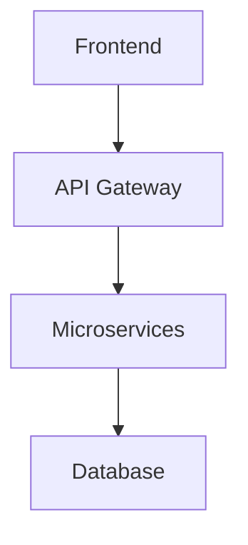

# Project Alpha

## Overview

Project Alpha is a cutting-edge web application designed to streamline workflow management.

## Features

- **Task Management**: Create, assign, and track tasks
- **Team Collaboration**: Real-time collaboration tools
- **Analytics**: Comprehensive reporting and analytics
- **Integration**: Seamless integration with popular tools

## Architecture

## Getting Started

1. Clone the repository
2. Install dependencies: `npm install`
3. Start the development server: `npm run dev`

## API Endpoints

- `GET /api/tasks` - Retrieve all tasks
- `POST /api/tasks` - Create a new task
- `PUT /api/tasks/:id` - Update a task
- `DELETE /api/tasks/:id` - Delete a task